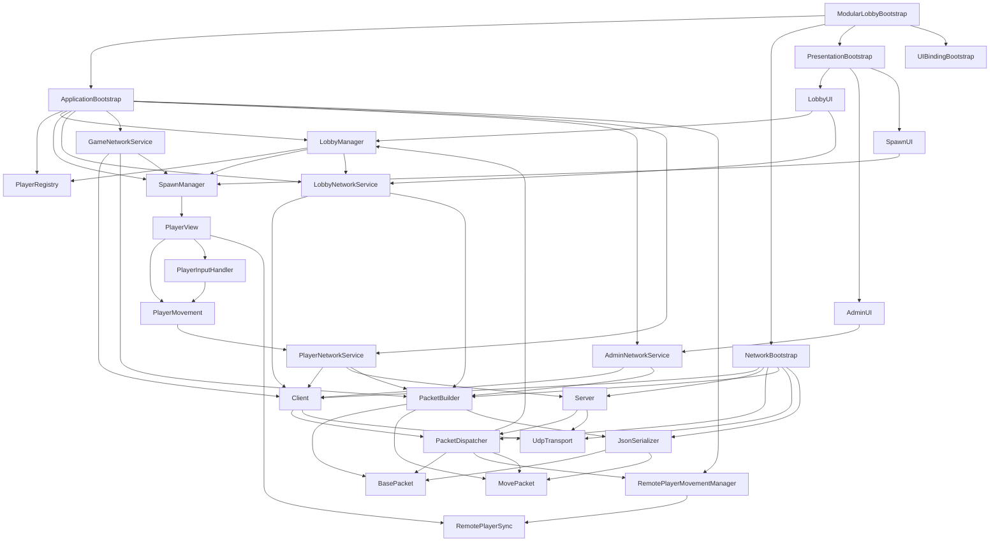
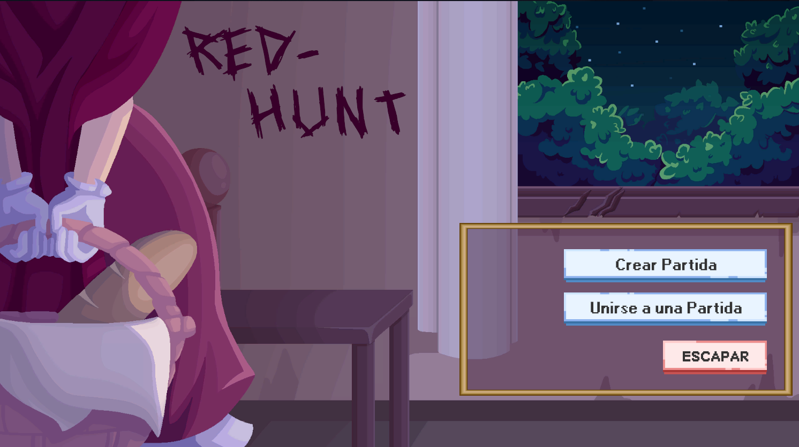
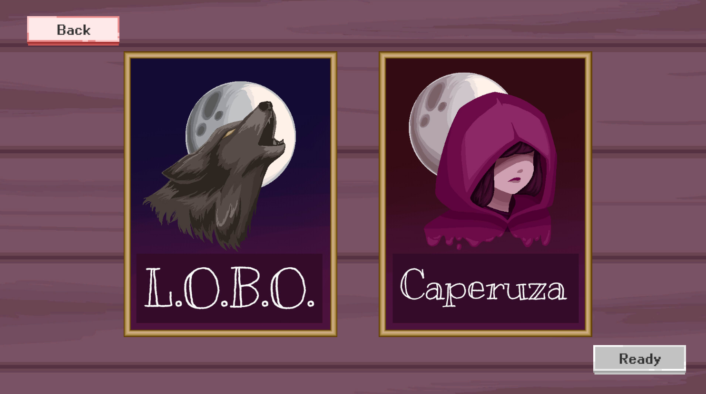
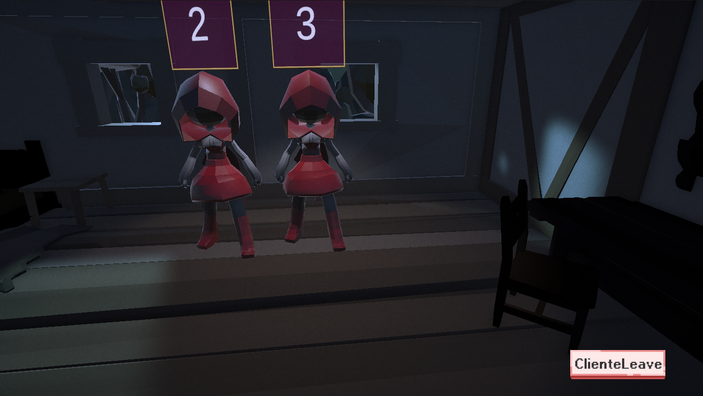
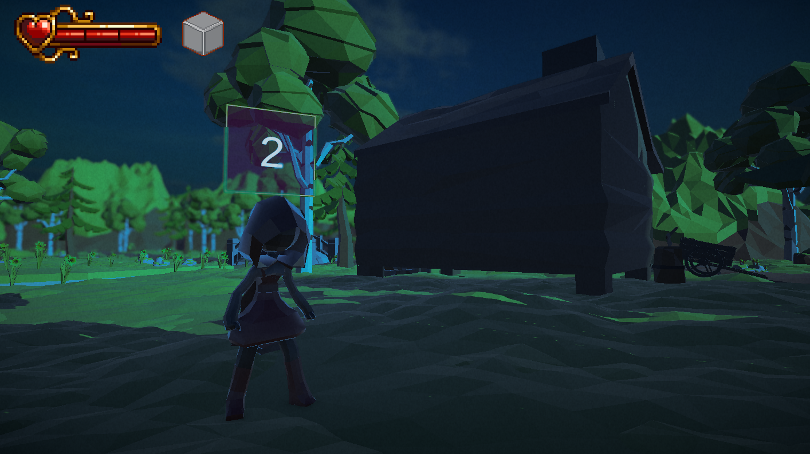
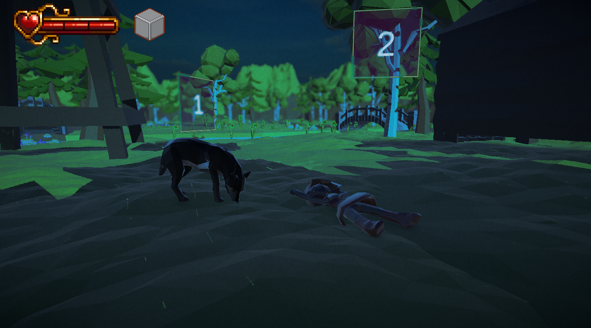
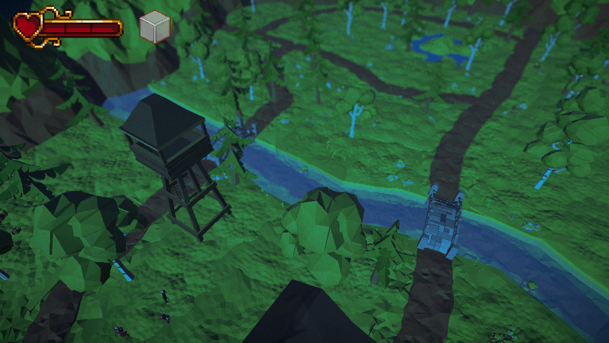
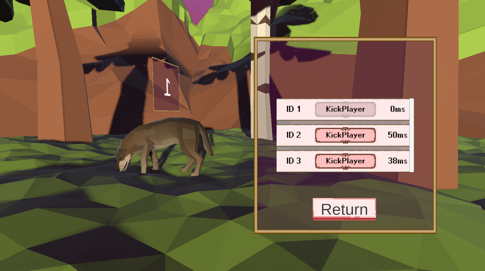
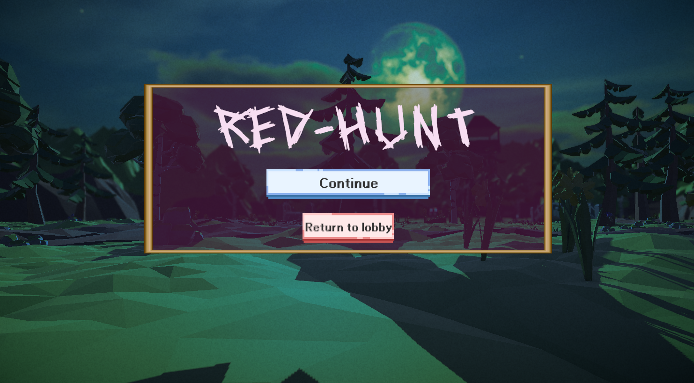
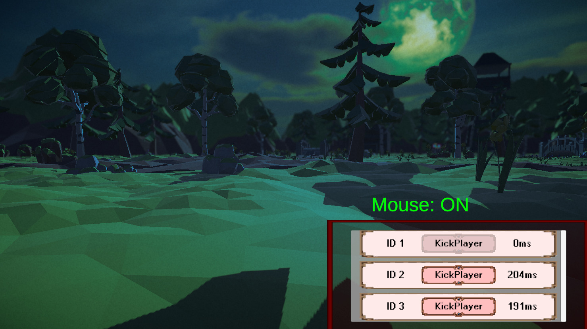

 Red Hunt - Documentación de Implementación Real

> Juego multijugador Player Host en Unity con arquitectura de red robusta, sincronización en tiempo real y mecánicas de ataque/defensa/recolección.


---

## Índice

1. [Descripción general](#descripción-general)
2. [Arquitectura del sistema](#arquitectura-del-sistema)
3. [Protocolo de red](#protocolo-de-red)
4. [Flujos de mensajes y envío](#flujos-de-mensajes-y-envío)
5. [Estructura de los mensajes](#estructura-de-los-mensajes)
6. [Mecánicas del juego](#mecánicas-del-juego)
7. [Sistema Host: Latencia, Kick y Pausa](#sistema-host-latencia-kick-y-pausa)
8. [Ejemplos de implementación real](#ejemplos-de-implementación-real)
9. [Tabla de scripts](#tabla-de-scripts)
10. [Estructura del proyecto](#estructura-del-proyecto)
11. [Interfaz del usuario](#interfaz-del-usuario)
12. [Flujo de juego](#flujo-de-juego)
13. [Características principales](#características-principales)

---

## Descripción general

**Red Hunt** es un juego multijugador asimétrico con arquitectura de red en 4 capas. Usa **UDP** para baja latencia y sincronización cada 100ms mediante snapshots. 

**Mecánica central:** Un jugador es **Killer** (atacante con daño) y 1+ jugadores son **Escapists** (recolectores de pistas con salud limitada). El Killer debe derrotar a los Escapists antes de que estos logren sus objetivos.

El proyecto está estructurado en:
- **Application Layer:** Lógica de negocio (lobby, roles, gamestate)
- **Domains Layer:** Modelos (Player, PlayerSession)
- **Network Layer:** UDP, serialización JSON, packets
- **Presentation Layer:** UI, input, rendering, bootstrap modular

---

## Arquitectura del sistema

### Vista general de capas

```
┌──────────────────────────────────────────────┐
│              PRESENTATION LAYER               │
│  PlayerMovement · PlayerInputHandler          │
│  RemotePlayerSync · KillerAttack · UI         │
└────────────────────┬─────────────────────────┘
                     │ Events
┌────────────────────▼─────────────────────────┐
│              APPLICATION LAYER                │
│  LobbyManager · PlayerNetworkService          │
│  GameNetworkService · SpawnManager            │
│  GameStateManager · Mechanics                 │
└────────────────────┬─────────────────────────┘
                     │ Network Messages
┌────────────────────▼─────────────────────────┐
│               NETWORK LAYER                   │
│  Client · Server · PacketDispatcher           │
│  PacketBuilder · JsonSerializer · Handlers    │
└────────────────────┬─────────────────────────┘
                     │ UDP Datagrams
┌────────────────────▼─────────────────────────┐
│              TRANSPORT LAYER                  │
│  UdpTransport (puerto 7777 configurable)      │
└────────┬───────────────┬────────────┬────────┘
         ▼               ▼            ▼
       HOST          CLIENT 1     CLIENT 2
```

### Ciclo de sincronización

```
t=0ms     PlayerInputHandler captura WASD + Mouse
          PlayerMovement aplica física al Rigidbody

t=100ms   [Cliente] PlayerNetworkService.SendMove()
            → MovePacket { position, rotation, velocity }
            → Client envía UDP al servidor

          [Host] PlayerNetworkService.SendSnapshot()
            → SnapshotPacket con estado de TODOS los jugadores
            → BroadcastService envía a todos los clientes

t=116ms   RemotePlayerMovementManager.ProcessMove()
            → RemotePlayerSync actualiza targetPosition/targetRotation
            → Lerp suave cada frame
```

---

## Protocolo de red

### UDP 

**Características:**
- Bajo latencia (ideal para movimiento y mecánicas en tiempo real)
- Sin garantía de entrega (aceptable para movimiento)
- Sin orden garantizado (manejado por timestamps)
- Mejor para datos en tiempo real

**Implementación:**
```
UdpTransport.cs → Interfaz ITransport
├── Envío: UdpClient.SendAsync()
├── Recepción: ReceiveLoop() asincrónico
└── Manejo de errores: SocketException, ObjectDisposedException
```

**Ventajas en Red Hunt:**
- Movimiento sin retrasos de confirmación
- Permite snapshots frecuentes (100ms)
- Escalable a múltiples clientes
---


## Flujos de mensajes y envío

### Tipos de paquetes

| Tipo | Dirección | Descripción |
|---|---|---|
| ASSIGN_PLAYER | Servidor → Cliente | Asigna ID al cliente al conectarse |
| LOBBY_STATE | Servidor → Todos | Sincroniza lista de jugadores del lobby |
| PLAYER_READY | Cliente → Servidor | Jugador marca como listo |
| START_GAME | Servidor → Todos | Inicia el juego |
| MOVE | Cliente → Servidor | Posición/rotación/velocidad local |
| SNAPSHOT | Servidor → Todos | Estado de todos los jugadores |
| HEALTH_UPDATE | Cliente → Servidor | Actualización de salud del Escapist |
| ESCAPISTS_CLUES | Servidor → Todos | Pistas recolectadas por Escapists |
| ESCAPISTS_PASSED | Cliente → Servidor | Escapist alcanzó zona de victoria |
| WIN_GAME | Servidor → Todos | Notifica condición de victoria/derrota |
| REMOVE_PLAYER | Broadcast | Jugador desconectado |
| KICK | Servidor → Cliente | Expulsión del lobby |
| DISCONNECT | Cliente → Servidor | Desconexión limpia |

### Flujo Cliente → Servidor

```
PlayerMovement.cs      (captura input local)
      ↓
PlayerNetworkService   (crea MovePacket)
      ↓
PacketBuilder          (serializa a JSON)
      ↓
Client.cs              (envía vía transport)
      ↓
UdpTransport           ──→ Servidor
```

### Flujo Servidor → Clientes (broadcast)

```
PlayerNetworkService   (recopila estados de todos)
      ↓
PacketBuilder          (crea SnapshotPacket)
      ↓
BroadcastService       (itera conexiones)
      ↓
Server.SendToClientAsync() × N
      ↓
UdpTransport.SendToAll()
```

### Flujo de recepción

```
UdpTransport.ReceiveLoop()
      ↓
OnMessageReceived event
      ↓
PacketDispatcher.Dispatch()
      ↓
Handler registrado por tipo
      ↓
Lógica de aplicación
```

---

## Estructura de los mensajes

### Formato de paquetes (JSON)

#### MovePacket

```json
{
  "type": "MOVE",
  "id": 2,
  "position": { "x": 10.5, "y": 1.2, "z": 5.3 },
  "rotation": { "x": 0, "y": 0.707, "z": 0, "w": 0.707 },
  "velocity": { "x": 5.0, "y": 0.0, "z": 0.0 },
  "timestamp": 1234567890
}
```

#### AssignPlayerPacket

```json
{
  "type": "ASSIGN_PLAYER",
  "id": 2
}
```

#### PlayerReadyPacket

```json
{
  "type": "PLAYER_READY",
  "playerId": 2,
  "role": "Killer"
}
```

#### LobbyStatePacket

```json
{
  "type": "LOBBY_STATE",
  "Players": [
    { "Id": 1, "Name": "Host", "IsHost": true, "Role": "Killer" },
    { "Id": 2, "Name": "Player_2", "IsHost": false, "Role": "Escapist" },
    { "Id": 3, "Name": "Player_3", "IsHost": false, "Role": "Escapist" }
  ]
}
```

#### PlayerStateSnapshot

```json
{
  "type": "SNAPSHOT",
  "players": [
    {
      "id": 1,
      "position": { "x": 0, "y": 1, "z": 0 },
      "rotation": { "x": 0, "y": 0, "z": 0, "w": 1 },
      "velocity": { "x": 0, "y": 0, "z": 0 },
      "isJumping": false
    },
    {
      "id": 2,
      "position": { "x": 5, "y": 1, "z": 5 },
      "rotation": { "x": 0, "y": 0.707, "z": 0, "w": 0.707 },
      "velocity": { "x": 3, "y": 0, "z": 0 },
      "isJumping": false
    }
  ]
}
```

#### HealthUpdatePacket

```json
{
  "type": "HEALTH_UPDATE",
  "playerId": 2,
  "currentHealth": 2,
  "maxHealth": 3
}
```

#### EscapistsCluesSnapshotPacket

```json
{
  "type": "ESCAPISTS_CLUES",
  "escapistClues": {
    "2": ["clue_1", "clue_3", "clue_5"],
    "3": ["clue_2", "clue_4"]
  }
}
```

#### WinGamePacket

```json
{
  "type": "WIN_GAME",
  "winner": "Killer",
  "killerId": 1,
  "reason": "All escapists defeated"
}
```

### Estructura de paquete base

```csharp
[System.Serializable]
public class BasePacket
{
    public string type;  // Identificador del tipo
}
```

### Serialización

- **Tecnología:** JsonUtility de Unity
- **Clase:** JsonSerializer.cs
- **Método:** JsonUtility.ToJson() / JsonUtility.FromJson<T>()

---

## Mecánicas del juego

Red Hunt implementa un sistema de juego asimétrico donde dos roles tienen objetivos opuestos:

### 🔪 Killer (Atacante)

**Objetivo:** Derrotar a todos los Escapists antes de que cumplan sus objetivos.

**Implementación:** `KillerAttack.cs`

**Mecánicas:**
- **Ataque cuerpo a cuerpo:** Ataca al Escapist cercano con cooldown de 0.5s
- **Daño por golpe:** 1 daño por ataque (configurable)
- **Animación:** Triggers de ataque sincronizados con `PlayerAnimationController`
- **Contacto automático:** El ataque se resuelve por distancia de proximidad
- **Red:** Los ataques se envían a todos los clientes vía `BroadcastService`

**Flujo de ataque:**
```
KillerAttack.Update()
    ↓
Detecta input de ataque local
    ↓
Valida cooldown (0.5s)
    ↓
Busca Escapist cercano
    ↓
Envía HEALTH_UPDATE packet
    ↓
BroadcastService envía a todos
    ↓
EscapistHealth recibe daño
```

### Escapist (Defensor/Recolector)

**Objetivo:** Recolectar todas las pistas del mapa y llegar a zona de victoria.

**Implementación:** `EscapistHealth.cs`, `ClueCollector.cs`, `PlayerWinTrigger.cs`
---

**Mecánicas principales:**

#### 1. Sistema de Salud
```csharp
// EscapistHealth.cs
private int maxHealth = 3;  // 3 impactos antes de morir
public event Action<int, int> OnHealthChanged;  // (playerId, newHealth)
public event Action<int> OnPlayerDied;          // (playerId)
```

**Estados:**
- Salud > 0: Vivo y movible
- Salud <= 0: Muerto (game over para ese jugador)
- Recibe eventos de OnHealthChanged para UI

#### 2. Recolección de Pistas
```csharp
// ClueCollector.cs
// Presionar E para recolectar pistas cercanas
OnInteract event → HandleInteractInput()
    ↓
Detecta ClueItemController cercano
    ↓
Envía OnClueCollected event
    ↓
EscapistClueRegistry.AddClue()
    ↓
EscapistCluesDisplay actualiza UI
```

**Características:**
- Pistas esparcidas en el mapa como objetos interactuables
- Se recolectan con la tecla "E" (interact)
- Se registran en `EscapistClueRegistry`
- UI muestra pistas recolectadas en tiempo real

#### 3. Condición de Victoria
```csharp
// PlayerWinTrigger.cs
OnTriggerEnter(Collider other)
    ↓
if (other.CompareTag("Win"))
    ↓
Envía EscapistsPassedSnapshot
    ↓
Servidor valida y actualiza estado
    ↓
WinGamePacket notifica a todos
```

**Condiciones de victoria:**
- **Escapist gana:** Toca collider con tag "Win"
- **Killer gana:** Todos los Escapist tienen health <= 0
- La victoria se valida en servidor

### 🔄 Sistema de Sincronización

**Snapshot cada 100ms:** El host recolecta posición, rotación y velocidad de todos los jugadores y envía un snapshot único.

```csharp
// PlayerNetworkService.cs
if (isHost)
{
    timeSinceLastSnapshot += Time.fixedDeltaTime;
    if (timeSinceLastSnapshot >= snapshotRate) // 0.1s
    {
        SendPlayerStateSnapshot();  // Envía estado de TODOS
        timeSinceLastSnapshot = 0f;
    }
}
else
{
    timeSinceLastSnapshot += Time.fixedDeltaTime;
    if (timeSinceLastSync >= syncRate)  // 0.1s
    {
        SendLocalPlayerPosition();  // Solo su MOVE
        timeSinceLastSync = 0f;
    }
}
```

**Ventaja:** Reducción de bandwidth al usar un snapshot central en lugar de múltiples MOVEs.

### ↔️ Interpolación de Movimiento Remoto

```csharp
// RemotePlayerSync.cs
OnRemotePositionReceived(MovePacket packet)
    ↓
transform.position = Lerp(current, target, speed * deltaTime)
transform.rotation = Lerp(current, target, speed * deltaTime)
rigidbody.velocity = packet.velocity
```

La interpolación es **local y suave**, sin saltos de posición.

---

## Sistema Host: Latencia, Kick y Pausa

El Host cuenta con herramientas de administración para monitorear y controlar la sesión de juego en tiempo real. Estas incluyen medición de latencia, expulsión de jugadores y pausa global.

### 📊 Sistema de Latencia (Ping/Pong)

**Implementación:** `LatencyService.cs`, `AdminPacketBuilder.cs`

El Host envía **pings periódicos a todos los clientes** para medir latencia de red.

**Características:**
- **Intervalo de ping:** Cada 2 segundos
- **Tipo de paquete:** ADMIN_PING (servidor → cliente)
- **Tipo de respuesta:** ADMIN_PONG (cliente → servidor)
- **Cálculo:** Diferencia de timestamps entre envío y recepción
- **Almacenamiento:** Se guarda en `ClientConnection.LastPingTimestamp`

**Flujo de medición:**

```
LatencyService.Update() → cada 2s
    ↓
SendPingsToAllClients()
    ↓
Para cada cliente conectado:
    ↓
AdminPacketBuilder.CreatePing(clientId)
    ↓
ADMIN_PING { type, clientId } enviado vía UDP
    ↓
[Cliente recibe]
    ↓
ClientPingHandler responde inmediatamente
    ↓
ADMIN_PONG { type, clientId } enviado al servidor
    ↓
[Host recibe]
    ↓
LatencyHandler procesa PONG
    ↓
Latency = ReceivedTime - SentTime (ms)
    ↓
Se actualiza en AdminUI.cs para mostrar al Host
```

**Uso en UI:**

```csharp
// AdminPlayerEntry.cs
public void Setup(int id, Action<int> onKick, int latency = 0)
{
    playerIdText.text = $"ID: {id}";
    latencyText.text = $"{latency}ms";  // Muestra latencia en tiempo real
    kickButton.onClick.AddListener(() => onKick.Invoke(id));
}
```

**Ventajas:**
- Monitoreo pasivo sin afectar gameplay
- Ayuda a detectar conexiones lentas
- Base para futuras mecánicas de compensación de lag
- Visible en AdminUI para el Host

---

### 🚪 Sistema de Kick (Expulsión)

**Implementación:** `AdminNetworkService.cs`, `AdminPacketBuilder.cs`, `AdminUI.cs`

El Host puede expulsar jugadores del lobby o durante la partida mediante el panel de administración.

**Características:**
- **Solo Host puede kickear:** `AdminNetworkService` valida autoridad
- **Efecto inmediato:** El jugador es removido del servidor y los demás clientes
- **Limpieza:** Se remueven datos del lobby, spawn y conexiones
- **Notificación:** Todos los clientes reciben REMOVE_PLAYER packet

**Flujo de expulsión:**

```
Host click en botón KICK → AdminUI.HandleKickClicked(targetId)
    ↓
AdminUI.OnKickRequested?.Invoke(targetId)
    ↓
AdminNetworkService.KickPlayer(targetId)
    ↓
Validar: isHost == true
    ↓
ConnectionManager.TryGetEndpointById(targetId)
    ↓
LobbyManager.RemovePlayerRemote(targetId)
    ↓
SpawnManager.RemovePlayer(targetId)
    ↓
BroadcastService.SendToAll(REMOVE_PLAYER packet)
    ↓
ConnectionManager.RemoveClient(endpoint)
    ↓
Server.SendToClientAsync(KICK packet, endpoint)
    ↓
[Clientes afectados]
    ↓
Reciben REMOVE_PLAYER
    ↓
UI se actualiza (jugador desaparece del lobby)
    ↓
[Jugador kickeado]
    ↓
Recibe KICK packet
    ↓
Desconexión automática
    ↓
Vuelve a Start screen
```

**Código de expulsión (AdminNetworkService.cs):**

```csharp
public async Task<bool> KickPlayer(int targetId)
{
    if (!isHost)
    {
        Debug.LogWarning("[AdminNetworkService] Only host can execute KickPlayer");
        return false;
    }

    if (!connectionManager.TryGetEndpointById(targetId, out var endpoint))
    {
        Debug.LogWarning($"[AdminNetworkService] Endpoint not found for id {targetId}");
        return false;
    }

    try
    {
        // 1. Remover del lobby
        lobbyManager.RemovePlayerRemote(targetId);
        
        // 2. Remover del spawn
        spawnManager?.RemovePlayer(targetId);

        // 3. Notificar a todos
        var removePacket = packetBuilder.CreateRemovePlayer(targetId);
        await broadcastService.SendToAll(removePacket);

        // 4. Cerrar conexión
        connectionManager.RemoveClient(endpoint);

        // 5. Enviar paquete de KICK al cliente (informar)
        var adminKick = adminBuilder.CreateKick(targetId);
        await server.SendToClientAsync(adminKick, endpoint);

        return true;
    }
    catch (System.Exception e)
    {
        Debug.LogError($"[AdminNetworkService] Error kicking player {targetId}: {e.Message}");
        return false;
    }
}
```

**Paquete de Kick:**

```json
{
  "type": "ADMIN_KICK",
  "playerId": 2,
  "reason": "Kicked by host"
}
```

---

### ⏸️ Sistema de Pausa Global

**Implementación:** `AdminNetworkService.cs`, `GameManager.cs`, `AdminPacketBuilder.cs`

El Host puede pausar/reanudar la partida para todos los jugadores simultáneamente.

**Características:**
- **Sincronización global:** La pausa afecta a TODOS los clientes
- **Control centralizado:** Solo el Host puede pausar
- **Persistencia:** El estado de pausa se mantiene hasta que el Host reanude
- **Preserva estado:** Los jugadores no pierden salud, pistas ni progreso

**Flujo de pausa:**

```
Host presiona TAB o click en botón PAUSA → AdminUI.TogglePause()
    ↓
AdminNetworkService.SetGlobalPause(true/false)
    ↓
Validar: isHost == true
    ↓
AdminPacketBuilder.CreatePause(paused)
    ↓
BroadcastService.SendToAll(PAUSE packet)
    ↓
[Todos los clientes]
    ↓
Reciben ADMIN_PAUSE { type, paused: true }
    ↓
AdminPacketHandler.HandlePausePacket()
    ↓
GameManager.SetPaused(true)
    ↓
Time.timeScale = 0f  (congela TODO: movimiento, física, animaciones)
    ↓
GameplayUI muestra "PAUSADO"
    ↓
Jugadores pueden ver el mapa pero no actúan
    ↓
[Host reanuda]
    ↓
Presiona TAB nuevamente
    ↓
SetGlobalPause(false)
    ↓
Broadcast: ADMIN_PAUSE { paused: false }
    ↓
Time.timeScale = 1f  (reanuda todo)
```

**Código de pausa (AdminNetworkService.cs):**

```csharp
public async Task<bool> SetGlobalPause(bool pause)
{
    if (!isHost)
    {
        Debug.LogWarning("[AdminNetworkService] Only host can pause the game");
        return false;
    }

    try
    {
        var pausePacket = adminBuilder.CreatePause(pause);
        await broadcastService.SendToAll(pausePacket);
        return true;
    }
    catch (System.Exception e)
    {
        Debug.LogError($"[AdminNetworkService] Error sending pause: {e.Message}");
        return false;
    }
}
```

**Implementación en GameManager:**

```csharp
// GameManager.cs
private static bool gamePaused = false;
public static bool GamePaused => gamePaused;

public static void SetPaused(bool paused)
{
    gamePaused = paused;
    Time.timeScale = paused ? 0f : 1f;
    
    Debug.Log($"[GameManager] Game paused: {paused}");
    OnGamePausedChanged?.Invoke(paused);
}
```

**Paquete de Pausa:**

```json
{
  "type": "ADMIN_PAUSE",
  "paused": true,
  "timestamp": 1234567890
}
```

---

### 📋 Tabla de paquetes Admin

| Tipo | Dirección | Descripción |
|------|-----------|-------------|
| ADMIN_PING | Host → Cliente | Solicitud de latencia (timestamp) |
| ADMIN_PONG | Cliente → Host | Respuesta de latencia (timestamp) |
| ADMIN_KICK | Host → Cliente | Expulsión del jugador |
| ADMIN_PAUSE | Host → Todos | Control global de pausa |

---

### 🎮 Interfaz de administración

El **AdminUI** presenta un panel exclusivo para el Host:

```
┌──────────────────────────────────────────┐
│         ADMINISTRACIÓN DE JUGADORES       │
├──────────────────────────────────────────┤
│ ID | Nombre      | Latencia | Acción    │
├────┼─────────────┼──────────┼───────────┤
│  1 | Host        | 0ms      | -         │
│  2 | Player_A    | 45ms     | [KICK]    │
│  3 | Player_B    | 67ms     | [KICK]    │
│  4 | Player_C    | 23ms     | [KICK]    │
├──────────────────────────────────────────┤
│ [PAUSAR JUEGO]  [CERRAR SERVIDOR]       │
└──────────────────────────────────────────┘
```

**Elementos:**
- **Latencia en tiempo real:** Se actualiza cada 2 segundos
- **Botón KICK:** Expulsa al jugador inmediatamente
- **Botón PAUSAR:** Pausa/reanuda la partida
- **Botón CERRAR:** Apaga el servidor

---

## Ejemplos de implementación real

### Ejemplo 1: Killer ataca a Escapist

```csharp
// KillerAttack.cs - Ataque del Killer
private void Update()
{
    if (!isLocal) return;  // Solo ejecutar en local
    
    timeSinceLastAttack += Time.deltaTime;
    
    if (inputHandler.IsAttacking && timeSinceLastAttack >= attackCooldown)
    {
        // Buscar Escapist cercano
        EscapistHealth target = FindNearestEscapist();
        
        if (target != null)
        {
            timeSinceLastAttack = 0f;
            
            // Generar evento de ataque
            target.TakeDamage(damagePerHit);
            OnAttackConnected?.Invoke(playerId, target.PlayerId);
            
            // Enviar a todos los clientes
            if (isHost && broadcastService != null)
            {
                var healthUpdateJson = packetBuilder.CreateHealthUpdate(
                    target.PlayerId, 
                    target.CurrentHealth
                );
                _ = broadcastService.SendToAll(healthUpdateJson);
            }
        }
    }
}
```

### Ejemplo 2: Escapist recibe daño

```csharp
// EscapistHealth.cs - Sistema de salud
public void TakeDamage(int damage)
{
    if (!IsAlive) return;
    
    currentHealth -= damage;
    OnHealthChanged?.Invoke(playerId, currentHealth);
    
    if (currentHealth <= 0)
    {
        HandleDeath();
    }
}

private void HandleDeath()
{
    OnPlayerDied?.Invoke(playerId);
    
    if (playerMovement != null)
        playerMovement.enabled = false;  // Detener movimiento
    
    if (animationController != null)
        animationController.PlayDeathAnimation();
}
```

### Ejemplo 3: Escapist recolecta pistas

```csharp
// ClueCollector.cs - Recolección de pistas
private void OnEnable()
{
    if (inputHandler != null)
    {
        inputHandler.OnInteract += HandleInteractInput;
    }
}

private void HandleInteractInput()
{
    if (nearbyClueController == null) return;
    
    // Validar proximidad
    float distance = Vector3.Distance(transform.position, nearbyClue.transform.position);
    if (distance > interactionDistance) return;
    
    // Recolectar pista
    string clueId = nearbyClueController.GetClueId();
    clueRegistry.AddClue(clueId);
    nearbyClueController.Collect();
    
    OnClueCollected?.Invoke(playerId, clueId);
    
    // Notificar UI
    if (isLocal && OnClueCollected != null)
    {
        // UI se actualiza automáticamente
    }
}
```

### Ejemplo 4: Escapist alcanza zona de victoria

```csharp
// PlayerWinTrigger.cs - Sistema de victoria
private void OnTriggerEnter(Collider other)
{
    if (gameWon) return;
    
    if (other.CompareTag("Win"))
    {
        HandleWinCollision();
    }
}

private async void HandleWinCollision()
{
    if (playerId < 0) return;
    
    gameWon = true;
    passedEscapists.Add(playerId);
    
    // Notificar al servidor a través de GameNetworkService
    if (gameNetworkService != null)
    {
        await gameNetworkService.SendEscapistPassedAsync(playerId);
    }
    
    // Verificar si todos los Escapist pasaron
    if (AllEscapistsHavePassed())
    {
        gameStateManager?.SetGameWon();
    }
}
```

### Ejemplo 5: Host envía snapshot cada 100ms

```csharp
// PlayerNetworkService.cs - Snapshot del host
private void FixedUpdate()
{
    if (!isHost) return;  // Solo host envía snapshots
    
    timeSinceLastSnapshot += Time.fixedDeltaTime;
    
    if (timeSinceLastSnapshot >= snapshotRate)  // 0.1s
    {
        SendPlayerStateSnapshot();
        timeSinceLastSnapshot = 0f;
    }
}

private void SendPlayerStateSnapshot()
{
    var playersData = new Dictionary<int, (Transform transform, Vector3 velocity, bool isJumping)>();
    
    // Recolectar datos de TODOS los jugadores
    var allPlayers = lobbyManager.GetAllPlayers();
    foreach (var playerSession in allPlayers)
    {
        var playerGO = spawnManager.GetPlayerGameObject(playerSession.Id);
        if (playerGO == null) continue;
        
        var playerMovementComponent = playerGO.GetComponent<PlayerMovement>();
        playersData[playerSession.Id] = (
            playerGO.transform,
            playerMovementComponent.CurrentVelocity,
            playerMovementComponent.IsJumping
        );
    }
    
    string snapshotJson = playerPacketBuilder.CreatePlayerStateSnapshot(playersData);
    _ = broadcastService.SendToAll(snapshotJson);
}
```
---
## Tabla de scripts

### Application Layer - Services

| Script | Función |
|--------|---------|
| LobbyManager.cs | Control del estado del lobby y gestión de jugadores |
| LobbyNetworkService.cs | Comunicación de red del lobby (join, leave, ready, start) |
| GameNetworkService.cs | Comunicación de red durante el juego (victoria, pistas, estado) |
| AdminNetworkService.cs | Gestión de admin (kick, pause, shutdown) |
| PlayerRegistry.cs | Registro de IDs de jugadores con reutilización |

### Application Layer - Systems

| Script | Función |
|--------|---------|
| PlayerNetworkService.cs | Sincronización de movimiento: snapshots (host) + MOVEs (clientes) |
| RemotePlayerMovementManager.cs | Gestor centralizado de jugadores remotos |
| SpawnManager.cs | Spawn/remoción de jugadores (Killer y Escapist) |
| GameStateManager.cs | Gestor del estado del juego (victoria/derrota) |

### Application Layer - Gameplay Mechanics

| Script | Función |
|--------|---------|
| KillerAttack.cs | Sistema de ataque del Killer |
| EscapistHealth.cs | Sistema de salud del Escapist (3 puntos) |
| ClueCollector.cs | Recolección de pistas para Escapist |
| ClueItemController.cs | Control de items de pistas en el mapa |
| PlayerWinTrigger.cs | Validación de condiciones de victoria |
| DoorController.cs | Control de puertas interactuables |

### Domains Layer

| Script | Función |
|--------|---------|
| Player.cs | Entidad del jugador |
| PlayerSession.cs | Sesión individual de jugador |
| PlayerType.cs | Enumeración de roles (Killer, Escapist) |

### Network Layer - Transporte

| Script | Función |
|--------|---------|
| UdpTransport.cs | Implementación de transporte UDP |
| Client.cs | Cliente de red (conexión al servidor) |
| Server.cs | Servidor de red (escucha conexiones) |
| BroadcastService.cs | Broadcast a todos los clientes |
| ClientConnectionManager.cs | Gestión de conexiones cliente |

### Network Layer - Dispatching y Handling

| Script | Función |
|--------|---------|
| PacketDispatcher.cs | Enrutador de paquetes por tipo |
| ConnectionHandler.cs | Manejo de conexión/desconexión |
| AdminPacketHandler.cs | Manejo de paquetes admin |
| LatencyHandler.cs | Manejo de ping/pong |

### Network Layer - Packets

| Script | Tipo | Función |
|--------|------|---------|
| BasePacket.cs | Base | Estructura base { type } |
| MovePacket.cs | MOVE | Posición, rotación, velocidad |
| PlayerStateSnapshot.cs | SNAPSHOT | Estado de todos los jugadores |
| HealthUpdatePacket.cs | HEALTH_UPDATE | Actualización de salud Escapist |
| StartGamePacket.cs | START_GAME | Inicia el juego |
| WinGamePacket.cs | WIN_GAME | Notifica condición de victoria |
| EscapistsPassedSnapshotPacket.cs | ESCAPISTS_PASSED | Escapist llegó a zona win |
| EscapistsCluesSnapshotPacket.cs | ESCAPISTS_CLUES | Estado de pistas recolectadas |
| AssignPlayerPacket.cs | ASSIGN_PLAYER | Asigna ID al cliente |
| PlayerReadyPacket.cs | PLAYER_READY | Jugador listo |
| PlayerPacket.cs | PLAYER | Info del jugador |

### Network Layer - Serialización

| Script | Función |
|--------|---------|
| JsonSerializer.cs | Serializador JSON wrapper para JsonUtility |
| PlayerPacketBuilder.cs | Constructor de paquetes de jugador |
| AdminPacketBuilder.cs | Constructor de paquetes admin |
| PacketBuilder.cs | Constructor general de paquetes |

### Presentation Layer - UI

| Script | Función |
|--------|---------|
| LobbyUI.cs | UI principal del lobby |
| GameUI.cs | UI del gameplay |
| WinUI.cs | UI de pantalla de victoria |
| AdminUI.cs | UI de administración |
| HealthUIDisplay.cs | Display de salud del Escapist |
| EscapistCluesDisplay.cs | Display de pistas recolectadas |
| LeaveButton.cs | Botón para abandonar |
| ShutdownButton.cs | Botón para apagar servidor |
| SpawnUI.cs | UI de spawn de jugadores |
| PlayerIdLabelUI.cs | Etiqueta de ID de jugador |

### Presentation Layer - Player

| Script | Función |
|--------|---------|
| PlayerMovement.cs | Movimiento WASD 8 direcciones |
| PlayerInputHandler.cs | Handler de input (WASD, E, Mouse, Click) |
| RemotePlayerSync.cs | Interpolación suave de jugadores remotos |
| PlayerView.cs | Representación visual del jugador |
| PlayerAnimationController.cs | Control de animaciones |
| PlayerWinTrigger.cs | Trigger de victoria |

### Presentation Layer - Bootstrap

| Script | Función |
|--------|---------|
| ModularLobbyBootstrap.cs | Orquestador principal |
| ApplicationBootstrap.cs | Inicializa capa Application |
| NetworkBootstrap.cs | Inicializa capa Network |
| PresentationBootstrap.cs | Inicializa capa Presentation |
| UIBindingBootstrap.cs | Wiring de eventos UI |
| GameplayBootstrap.cs | Inicializa gameplay |
| PlayerCameraBootstrap.cs | Inicializa cámara del jugador |

### Utilidades

| Script | Función |
|--------|---------|
| GameManager.cs | Gestor estático del juego (pausa, escenas) |
| CursorMonitor.cs | Monitoreo y control del cursor |
| LatencyService.cs | Servicio de latencia (ping/pong) |

---

---
## Estructura del proyecto

### Mecánicas principales implementadas

Red Hunt implementa un **modelo asimétrico 1vsN** donde:

- **1 Killer:** Atacante con objetivo de derrotar a los Escapists mediante daño cuerpo a cuerpo
- **N Escapists:** Defensores con objetivo de recolectar pistas y llegar a zona de victoria
- **Movimiento:** WASD en 8 direcciones (sin saltos)
- **Sistema de salud:** Escapists tienen 3 puntos de vida; cada ataque del Killer quita 1
- **Sistema de pistas:** Pistas esparcidas en el mapa que los Escapists pueden recolectar
- **Victoria:** Killer gana si mata todos; Escapist gana si llega a zona win
- **Red:** UDP con snapshots 100ms, sincronización suave con Lerp
---

## Arquitectura actual

---
### Flujo principal del sistema

1. **Inicio:** Se inicializan los Installers y el ModularGameBootstrap.
2. **Lobby:** El jugador se conecta, se le asigna un ID y se sincroniza el estado del lobby.
3. **Gestión de jugadores:** El LobbyManager y PlayerRegistry controlan la entrada/salida y el tipo de cada jugador.
4. **Comunicación de red:** Los servicios y handlers de Network gestionan el envío/recepción de paquetes (join, leave, kick, etc.).
5. **Movimiento local:** PlayerInputHandler captura input (WASD+Mouse), PlayerMovement aplica physics y rotación de cámara.
6. **Sincronización de movimiento:** 
   - Host: PlayerNetworkService envía snapshots de TODOS los players cada 100ms (snapshotRate).
   - Clientes: PlayerNetworkService envía MOVEs locales cada 100ms (syncRate) con posición, rotación, velocidad e isJumping.
7. **Movimiento remoto:** RemotePlayerMovementManager recibe MovePackets y los delega a RemotePlayerSync, que interpola posición/rotación suavemente.
8. **UI:** La Presentation muestra el estado y permite acciones (admin, lobby, spawn).
9. **Desconexión/Remoción:** Se limpian los estados y se actualiza la UI.

---


### Diagrama de flujo de archivos y comunicación



## Estructura del proyecto

```
Assets/red hunt/Scripts/
├── Application/
│   ├── Services/
│   │   ├── Admin/
│   │   │   └── AdminNetworkService.cs       # Lógica de kick y acciones de admin
│   │   ├── LobbyGame/
│   │   │   ├── LobbyManager.cs              # Estado y flujo del lobby
│   │   │   ├── LobbyNetworkService.cs       # Comunicación de red del lobby
│   │   │   ├── JoinLobbyCommand.cs          # Comando de entrada al lobby
│   │   │   ├── LeaveLobbyCommand.cs         # Comando de salida del lobby
│   │   │   └── ILobbyCommand.cs             # Interfaz base de comandos
│   │   └── Session/
│   │       ├── PlayerRegistry.cs            # Registro de IDs de jugadores
│   │       └── PlayerSession.cs             # Sesión individual de jugador
│   ├── Gameplay/
│   │   ├── Managers/
│   │   │   └── GameNetworkService.cs        # Comunicación de red durante gameplay
│   │   └── Mechanics/
│   │       ├── KillerAttack.cs              # Sistema de ataque del Killer
│   │       ├── EscapistHealth.cs            # Sistema de salud Escapist
│   │       ├── ClueCollector.cs             # Recolección de pistas
│   │       └── PlayerWinTrigger.cs          # Validación de victoria
│   └── Systems/
│       ├── Player/
│       │   ├── PlayerNetworkService.cs      # Sync de movimiento (snapshots/MOVEs)
│       │   └── RemotePlayerMovementManager.cs # Gestor de jugadores remotos
│       └── Spawn/
│           └── SpawnManager.cs              # Spawn y remoción de jugadores
│
├── Domains/
│   ├── Entities/
│   │   └── Player.cs                        # Entidad jugador
│   └── Enums/
│       ├── LobbyState.cs                    # Estados del lobby
│       └── PlayerType.cs                    # Tipos de jugador
│
├── Network/
│   ├── Dispatching/
│   │   └── PacketDispatcher.cs              # Enrutador de paquetes por tipo
│   ├── Handlers/
│   │   ├── AdminPacketHandler.cs            # Handler de paquetes admin
│   │   └── ConnectionHandler.cs             # Handler de conexión/desconexión
│   ├── Interfaces/
│   │   ├── IClient.cs
│   │   ├── IServer.cs
│   │   ├── ITransport.cs
│   │   ├── ISerializer.cs
│   │   └── IGameConnection.cs
│   ├── Packets/
│   │   ├── BasePacket.cs                    # Estructura base { type }
│   │   ├── PacketBuilder.cs                 # Constructor de paquetes
│   │   ├── PlayerCreate/
│   │   │   ├── AssignPlayerPacket.cs
│   │   │   ├── LobbyStatePacket.cs
│   │   │   ├── PlayerPacket.cs
│   │   │   └── PlayerReadyPacket.cs
│   │   ├── PlayerDestroy/
│   │   │   ├── DisconnectPacket.cs
│   │   │   └── RemovePlayerPacket.cs
│   │   ├── Admin/
│   │   │   └── KickPacket.cs
│   │   └── Game/
│   │       └── MovePacket.cs                # position, rotation, velocity, isJumping
│   ├── Serialization/
│   │   └── JsonSerializer.cs                # JsonUtility wrapper
│   └── Transport/
│       ├── Client/
│       │   ├── Client.cs
│       │   ├── ClientPacketHandler.cs
│       │   └── ClientState.cs
│       ├── Server/
│       │   ├── Server.cs
│       │   ├── BroadcastService.cs
│       │   ├── ClientConnection.cs
│       │   └── ClientConnectionManager.cs
│       └── UdpTransport.cs                  # Implementación ITransport vía UDP
│
└── Presentation/
    ├── Bootstrap/
    │   ├── ModularLobbyBootstrap.cs          # Orquestador principal
    │   └── BoostrapModular/
    │       ├── ApplicationBootstrap.cs
    │       ├── NetworkBootstrap.cs
    │       ├── PresentationBootstrap.cs
    │       └── UIBindingBootstrap.cs
    ├── Player/
    │   ├── PlayerView.cs                     # Representación visual
    │   ├── PlayerMovement.cs                 # WASD + salto + cámara
    │   ├── PlayerInputHandler.cs             # Unity InputSystem (Move/Look/Jump)
    │   └── RemotePlayerSync.cs              # Interpolación Lerp de remotos
    └── UI/
        ├── Admin/
        │   ├── AdminUI.cs
        │   └── AdminPlayerEntry.cs
        └── Lobby/
            ├── LobbyUI.cs
            ├── LeaveButton.cs
            ├── ShutdownButton.cs
            └── SpawnUI.cs
```

---

## Interfaz del usuario

### Pantallas principales

#### 1. Pantalla de Menu 

<p align="center">
  
</p>

#### 2. Pantalla de Selecciòn (Connect)
<p align="center">
  
</p>

#### 3. Pantalla de Caperucita Lobby (Players)
<p align="center">
  
</p>

#### 4. Pantalla de Vista Caperucita
<p align="center">
  
</p>

#### 5. Pantalla de Vista muerte de Caperucita 
<p align="center">
  
</p>

#### 6. Pantalla de Vista general de muerte Caperucita
<p align="center">
  
</p>

#### 7. Pantalla de Vista de el lobby Lobo
<p align="center">
  
</p>

#### 8. Pantalla de Vista victoria Lobo
<p align="center">
  
</p>
#### 9. Pantalla de Vista Pause
<p align="center">
  
</p>
#### 10. Pantalla de Vista HostGame
<p align="center">
  
</p>

### Estados y transiciones

```
START
  ├─ (Host) → HOSTING
  │           ├─ LOBBY (esperando clientes)
  │           ├─ GAME (jugando)
  │           └─ SHUTDOWN
  │
  └─ (Client) → CONNECTING
                ├─ CONNECTED
                ├─ LOBBY
                ├─ GAME
                └─ DISCONNECTED
```

### Componentes de UI clave

| Componente | Ubicación | Función |
|-----------|-----------|---------|
| LobbyUI.cs | Canvas/LobbyPanel | Selección de rol y estado del lobby |
| HealthUIDisplay.cs | Canvas/GameplayPanel | Muestra salud del Escapist (3/3) |
| EscapistCluesDisplay.cs | Canvas/GameplayPanel | Muestra pistas recolectadas (2/5) |
| WinUI.cs | Canvas/WinPanel | Pantalla de victoria con estadísticas |
| PlayerIdLabelUI.cs | Encima de cada jugador | Etiqueta flotante con ID |
| AdminUI.cs | Canvas/AdminPanel | Panel de admin (solo host) |

### Estados del UI según rol

**Killer:**
- Mostrar contador de ataques
- Indicador de enemigos activos
- Cooldown de ataque visual

**Escapist:**
- Mostrar barra de salud (3/3)
- Mostrar pistas recolectadas (X/5)
- Objetivo principal visible

---

## Flujo de juego

### Fase 1: Selección de roles (Lobby)

```
1. Host inicia servidor (escena LobbyScene)
2. Clientes se conectan con IP del host
3. Ambos seleccionan rol: Killer o Escapist
4. Host presiona "INICIAR PARTIDA"
5. Validación servidor:
   - Al menos 1 Killer
   - Al menos 1 Escapist
   - Máx 4 jugadores
6. Transición a GameScene
```

### Fase 2: Gameplay

```
[Killer]                    [Escapist 1]              [Escapist 2]
  ↓                            ↓                          ↓
Búsqueda activa          Recolecta pistas         Recolecta pistas
  ↓                            ↓                          ↓
Detecta cercanos         Llega a pista 1          Recolecta pista 1
  ↓                            ↓                          ↓
Ataque (Click)           Envía OnClueCollected    Recolecta pista 2
  ↓                            ↓                          ↓
HealthUpdate packet      Recolecta pistas 2-5    Alcanza zona Win
  ↓                            ↓                          ↓
Broadcast a todos        Llega a zona Win         Envía WinGamePacket
  ↓                            ↓                          ↓
Escapist 1 sufre daño    Logra victoria          Victoria Escapist
```

### Fase 3: Fin de partida

```
Condición: Un bando ha ganado

VICTORIA KILLER:
  ↓
  Todos los Escapist tienen health <= 0
  ↓
  Servidor envía WinGamePacket
  ↓
  Mostrar WinUI con estadísticas
  ↓
  Opción: Volver al lobby

VICTORIA ESCAPIST:
  ↓
  N Escapists alcanzaron zona Win
  ↓
  PlayerWinTrigger envía EscapistsPassedSnapshot
  ↓
  Servidor valida y envía WinGamePacket
  ↓
  Mostrar WinUI con estadísticas
```

### Sincronización en red

```
[Host]
  ↓
Recolecta estado de todos los jugadores
  ↓
Cada 100ms (snapshotRate = 0.1)
  ↓
Crea PlayerStateSnapshot
  ↓
Envía a todos vía BroadcastService
  ↓
[Clientes]
  ↓
Reciben snapshot
  ↓
RemotePlayerMovementManager.ProcessMovePacket()
  ↓
RemotePlayerSync.OnRemotePositionReceived()
  ↓
Lerp suave a nueva posición
  ↓
Resultado: Movimiento fluido sin saltos
```

---

## Características principales

### Implementadas y funcionando

| Característica | Detalle |
|---|---|
| **Movimiento** | WASD en 8 direcciones, cámara con mouse (pitch/yaw), sin saltos |
| **Roles asimétricos** | Killer (atacante) vs Escapist (defensor/recolector) |
| **Sistema de ataque** | Killer ataca con cooldown de 0.5s, daño 1 por golpe |
| **Sistema de salud** | Escapist tiene 3 puntos de vida; muere al llegar a 0 |
| **Recolección de pistas** | Escapist presiona E para recolectar pistas del mapa |
| **Sistema de victoria** | Killer gana eliminando todos; Escapist gana alcanzando zona win |
| **Sincronización de red** | Snapshots cada 100ms, UDP, low latency |
| **Interpolación** | Movimiento remoto suave con Lerp |
| **Arquitectura modular** | 4 capas (Network, Application, Domains, Presentation) |
| **Bootstrap limpio** | Installers + BoostrapModular, sin God Classes |
| **Lobby robusto** | Join/Leave/Ready/Kick con validación servidor |
| **Serialización JSON** | JsonUtility para compatibilidad total |
| **UI completa** | Lobby, Gameplay, Win, Health, Clues, Admin |
| **Animaciones** | PlayerAnimationController sincronizado |

---
## Requisitos técnicos

- **Unity:** 2021.3 LTS o superior
- **.NET Framework:** 4.7.1+
- **OS:** Windows, macOS, Linux
- **Networking:** UDP (configurable puerto 7777)
- **Resolución:** 1920x1080 (configurable)
- **FPS Target:** 60 (configurable)

---

## Controles del juego

| Input | Acción |
|-------|--------|
| **WASD** | Movimiento en 8 direcciones |
| **Mouse** | Rotación de cámara (pitch/yaw) |
| **Click izquierdo** | Atacar (Killer) |
| **E** | Interactuar/Recolectar pistas (Escapist) |
| **Tab** | Toggle pause (solo host) |
| **ESC** | Menú / Salir |

---

*Versión 1.0.0 — Última actualización: 19/04/2026*

**Nota:** Este README refleja la implementación real del proyecto. Toda sección o mecánica NO incluida en este documento NO está implementada en el código.
