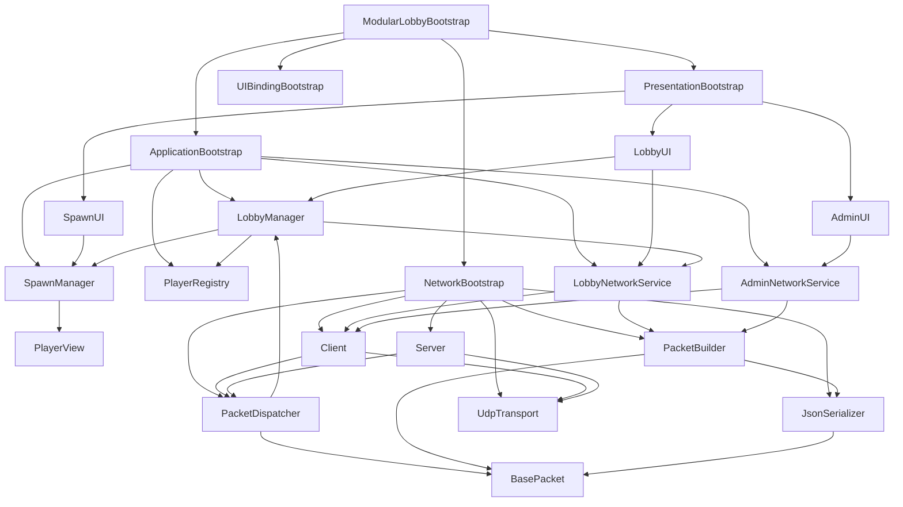

# Red Hunt — Estado y Arquitectura del Proyecto (Actualizado 30/03/2026)

## Resumen de cambios recientes (commit lobby)

- **Lobby robusto y seguro:**
  - El host siempre es ID 1 (evita condiciones de carrera).
  - IDs de jugadores reutilizables y control de máximo de jugadores.
  - Flujo de join/leave/kick robusto: broadcast de REMOVE_PLAYER, limpieza local y desconexión ordenada.
  - Mejoras en handshake y transporte cliente-servidor, manejo de errores y desconexión.
  - Soporte para iniciar partida y sincronizar estado del lobby.

- **Principales archivos modificados:**
  - `LobbyNetworkService.cs`: Forzado de ID host, lógica de join/leave, shutdown ordenado, manejo de paquetes y sincronización de estado.
  - `LobbyManager.cs`: Añadir players remotos con ID, bloqueo para operaciones remotas, control de límite y notificaciones.
  - `PlayerRegistry.cs`: IDs reutilizables, métodos para aceptar IDs explícitos y actualizar tipo de jugador.
  - `ClientConnectionManager.cs`: IDs de cliente desde 2, reutilización y limpieza.
  - `ClientPacketHandler.cs`: Manejo de asignación de player, desconexión y limpieza de estado.
  - `ClientState.cs`: Estado de conexión y eventos.
  - `Client.cs`: Handshake robusto, mejor manejo de transporte y desconexión.
  - `Server.cs`: Dispatch de mensajes y limpieza.
  - `BroadcastService.cs`: Broadcast a todos los clientes.
  - `PacketBuilder.cs`: Nuevos builders para todos los paquetes clave.
  - `SpawnManager.cs`: Spawn/remove de players remotos y posiciones.
  - `UI/Admin/*`: Listado de jugadores, botón kick, flujo de kick y limpieza de estado.
  - `Network/Handlers/*`: Manejo centralizado y robusto de paquetes admin/connection.
  - `JoinLobbyCommand.cs` y `LeaveLobbyCommand.cs`: Integración de comandos en el flujo de lobby.
  - **Documentación:** Registro de cambios y explicación de problemas UDP/reordenamiento y soluciones.

## Objetivos cumplidos

- Evitar condiciones de carrera en asignación de IDs (host = ID 1 garantizado).
- Flujo de join/leave/kick robusto y ordenado.
- Reutilización segura de IDs y control del máximo de players.
- Mejoras en handshake, transporte y manejo de errores.
- Sincronización de estado y soporte para iniciar partida.

---

## Resumen Ejecutivo

El proyecto ahora cuenta con una **arquitectura profesional y escalable**:
- Separación clara de capas (Network, Application, Presentation)
- Patrón Installers para inicialización limpia
- Sin God Classes
- Bajo acoplamiento
- Fácil de testear y mantener

---


## Arquitectura actual

---

### ¿Qué hace cada script principal?

#### Application
- **AdminNetworkService.cs:** Gestiona la lógica de administración de red (acciones de admin, como kick, desde el cliente o servidor).
- **LobbyManager.cs:** Controla el estado y la lógica del lobby, incluyendo la gestión de jugadores y el flujo de entrada/salida.
- **LobbyNetworkService.cs:** Encapsula la comunicación de red específica del lobby (join, leave, sincronización de estado).
- **JoinLobbyCommand.cs / LeaveLobbyCommand.cs:** Comandos para unirse o salir del lobby, integrados en el flujo de comandos.
- **ILobbyCommand.cs:** Interfaz base para comandos del lobby.
- **PlayerRegistry.cs:** Lleva el registro de los jugadores activos y sus IDs, permitiendo reutilización y control de máximo.
- **PlayerSession.cs:** Representa la sesión individual de un jugador.
- **SpawnManager.cs:** Gestiona el spawn y remoción de jugadores en la escena.

#### Domains
- **Player.cs:** Entidad que representa a un jugador.
- **LobbyState.cs / PlayerType.cs:** Enumeraciones para el estado del lobby y tipos de jugador.

#### Network
- **PacketDispatcher.cs:** Encargado de distribuir los paquetes recibidos a los handlers correspondientes.
- **AdminPacketHandler.cs / ConnectionHandler.cs:** Manejan la lógica de los paquetes de administración y conexión.
- **IClient.cs, IServer.cs, ITransport.cs, IGameConnection.cs, ISerializer.cs:** Interfaces para abstracción de cliente, servidor, transporte y serialización.
- **KickPacket.cs:** Paquete específico para expulsar jugadores.
- **AdminPacketBuilder.cs / PacketBuilder.cs / BasePacket.cs:** Construcción y definición de paquetes de red.
- **AssignPlayerPacket.cs, AssignRejectPacket.cs, LobbyStatePacket.cs, PlayerPacket.cs, PlayerReadyPacket.cs:** Paquetes para sincronización y gestión de jugadores.
- **DisconnectPacket.cs, RemovePlayerPacket.cs:** Paquetes para desconexión y remoción de jugadores.
- **JsonSerializer.cs:** Serializador JSON para los datos de red.
- **Client.cs, ClientPacketHandler.cs, ClientState.cs:** Lógica y estado del cliente de red.
- **BroadcastService.cs, ClientConnection.cs, ClientConnectionManager.cs, Server.cs:** Lógica de servidor, conexiones y broadcast.
- **UdpTransport.cs:** Implementación del transporte UDP.


#### Presentation
- **Sistema modular de bootstrap:**
  - Se eliminó la God Class `GameBootstrap`/`LobbyBootstrap` y se reemplazó por un sistema modular basado en `ModularLobbyBootstrap`.
  - `ModularLobbyBootstrap` orquesta la inicialización y conexión de los bootstraps autónomos:
    - **ApplicationBootstrap:** Inicializa y expone los servicios de la capa Application, reexpone eventos clave (join/leave player).
    - **NetworkBootstrap:** Inicializa la red, conecta con Application y expone eventos de red (asignación de ID, desconexión, etc.).
    - **PresentationBootstrap:** Gestiona la UI y conecta los paneles visuales con los servicios y eventos de Application/Network.
    - **UIBindingBootstrap:** Realiza el binding de eventos entre la UI y los servicios, permitiendo flujos desacoplados y testables.
  - Cada bootstrap es autónomo y testable, y ModularLobbyBootstrap los orquesta y conecta.
- **AdminInstaller.cs, ApplicationInstaller.cs, NetworkInstaller.cs, PresentationInstaller.cs:** Instalan y configuran dependencias de cada capa.
- **PlayerView.cs:** Representación visual del jugador.
- **UI/Admin/**
  - **AdminPlayerEntry.cs, AdminUI.cs:** UI para administración de jugadores.
- **UI/Lobby/**
  - **LobbyUI.cs:** UI principal del lobby, maneja eventos de conexión, roles y estado de la sala.
  - **LeaveButton.cs:** Botón modular para abandonar el lobby, con control de visibilidad e interacción.
  - **ShutdownButton.cs:** Botón modular para apagar el servidor, con eventos y control de estado.
  - **SpawnUI.cs:** UI para mostrar y gestionar el spawn de jugadores, posiciones y roles.

Este sistema modular permite desacoplar responsabilidades, facilita el testing y la extensión, y elimina dependencias circulares y God Classes. Cada bootstrap puede evolucionar de forma independiente y ModularLobbyBootstrap se encarga de la orquestación y el wiring de eventos.

---

### Flujo principal del sistema

1. **Inicio:** Se inicializan los Installers y el GameBootstrap.
2. **Lobby:** El jugador se conecta, se le asigna un ID y se sincroniza el estado del lobby.
3. **Gestión de jugadores:** El LobbyManager y PlayerRegistry controlan la entrada/salida y el tipo de cada jugador.
4. **Comunicación de red:** Los servicios y handlers de Network gestionan el envío/recepción de paquetes (join, leave, kick, etc.).
5. **UI:** La Presentation muestra el estado y permite acciones (admin, lobby, spawn).
6. **Desconexión/Remoción:** Se limpian los estados y se actualiza la UI.

---


### Diagrama de flujo de archivos y comunicación



## Estructura completa de Scripts

```
Assets/red hunt/Scripts/
├── Application/
│   ├── Gameplay/ (vacío)
│   ├── Services/
│   │   ├── Admin/
│   │   │   └── AdminNetworkService.cs
│   │   ├── LobbyGame/
│   │   │   ├── ILobbyCommand.cs
│   │   │   ├── JoinLobbyCommand.cs
│   │   │   ├── LeaveLobbyCommand.cs
│   │   │   ├── LobbyManager.cs
│   │   │   └── LobbyNetworkService.cs
│   │   └── Session/
│   │       ├── PlayerRegistry.cs
│   │       └── PlayerSession.cs
│   └── Systems/
│       └── Spawn/
│           └── SpawnManager.cs
├── Domains/
│   ├── data/ (vacío)
│   ├── Entities/
│   │   └── Player.cs
│   ├── Enums/
│   │   ├── LobbyState.cs
│   │   └── PlayerType.cs
│   └── Interfaces/ (vacío)
├── Network/
│   ├── Dispatching/
│   │   └── PacketDispatcher.cs
│   ├── Handlers/
│   │   ├── AdminPacketHandler.cs
│   │   └── ConnectionHandler.cs
│   ├── Interfaces/
│   │   ├── IClient.cs
│   │   ├── IGameConnection.cs
│   │   ├── ISerializer.cs
│   │   ├── IServer.cs
│   │   └── ITransport.cs
│   ├── Packets/
│   │   ├── Admin/
│   │   │   └── KickPacket.cs
│   │   ├── AdminPacketBuilder.cs
│   │   ├── BasePacket.cs
│   │   ├── PacketBuilder.cs
│   │   ├── playerCreate/
│   │   │   ├── AssignPlayerPacket.cs
│   │   │   ├── AssignRejectPacket.cs
│   │   │   ├── LobbyStatePacket.cs
│   │   │   ├── PlayerPacket.cs
│   │   │   └── PlayerReadyPacket.cs
│   │   └── PlayerDestroy/
│   │       ├── DisconnectPacket.cs
│   │       └── RemovePlayerPacket.cs
│   ├── Serialization/
│   │   └── JsonSerializer.cs
│   └── Transport/
│       ├── Client/
│       │   ├── Client.cs
│       │   ├── ClientPacketHandler.cs
│       │   └── ClientState.cs
│       └── Server/
│           ├── BroadcastService.cs
│           ├── ClientConnection.cs
│           ├── ClientConnectionManager.cs
│           └── Server.cs
│       └── UdpTransport.cs
├── Presentation/
│   ├── Animation/ (vacío)
│   ├── Bootstrap/
│   │   ├── ModularLobbyBootstrap.cs
│   │   ├── LobbyBootstrap.cs (obsoleto)
│   │   ├── BoostrapModular/
│   │   │   ├── ApplicationBootstrap.cs
│   │   │   ├── NetworkBootstrap.cs
│   │   │   ├── PresentationBootstrap.cs
│   │   │   └── UIBindingBootstrap.cs
│   │   └── installers/
│   │       ├── AdminInstaller.cs
│   │       ├── ApplicationInstaller.cs
│   │       ├── NetworkInstaller.cs
│   │       └── PresentationInstaller.cs
│   ├── Player/
│   │   └── PlayerView.cs
│   ├── Sounds/ (vacío)
│   ├── UI/
│   │   ├── Admin/
│   │   │   ├── AdminPlayerEntry.cs
│   │   │   └── AdminUI.cs
│   │   └── Lobby/
│   │       ├── LobbyUI.cs
│   │       ├── LeaveButton.cs
│   │       ├── ShutdownButton.cs
│   │       └── SpawnUI.cs
│   └── VFX/ (vacío)
```

---


