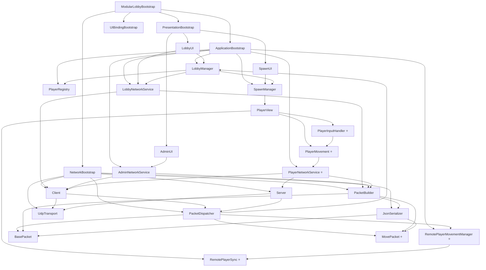

# Red Hunt - Documentación del Proyecto

**Última actualización:** 19 de abril de 2026  
**Versión:** 1.0.0

---

## Índice
1. [Descripción general](#descripción-general)
2. [Características principales](#características-principales)
3. [Protocolos de red](#protocolos-de-red)
4. [Envío de mensajes y archivos](#envío-de-mensajes-y-archivos)
5. [Estructura de los mensajes](#estructura-de-los-mensajes)
6. [Ejemplos de implementación](#ejemplos-de-implementación)
7. [Ejecución y uso](#ejecución-y-uso)
8. [Estructura del proyecto](#estructura-del-proyecto)
9. [Tabla de scripts](#tabla-de-scripts)
10. [Lógica de fragmentación (chunking)](#lógica-de-fragmentación-chunking)
11. [Arquitectura del sistema](#arquitectura-del-sistema)
12. [Interfaz del usuario](#interfaz-del-usuario)

---
## Descripción general

**Red Hunt** es un juego multijugador basado en Unity que implementa una **arquitectura de red robusta y escalable** con sincronización en tiempo real de jugadores, movimiento fluido y un sistema de lobby seguro. El proyecto utiliza protocolos UDP para comunicación de red de baja latencia y está estructurado en cuatro capas bien definidas: **Application**, **Domains**, **Network** y **Presentation**.

El sistema está optimizado para minimizar latencia, evitar condiciones de carrera y proporcionar una experiencia de juego fluida en redes locales (LAN).

### Objetivos principales:
- Sincronización robusta de jugadores en red
- Movimiento fluido con interpolación
- Lobby seguro sin condiciones de carrera
- Arquitectura desacoplada y mantenible
- Manejo seguro de conexiones/desconexiones
---

## Características principales

### 1. **Sistema de movimiento completo**
- Movimiento en **8 direcciones** (WASD) con velocidad configurable
- Sistema de **salto** con detección de terreno y drag dinámico
- Control de cámara con rotación **vertical (pitch)** y **horizontal (yaw)**
- Sensibilidad de ratón configurable
- Integración con **Unity Input System** (PlayerInput)

### 2. **Sincronización de red en tiempo real**
- **Host:** Envía snapshots de TODOS los jugadores cada 100ms
- **Clientes:** Envían MOVEs locales con posición, rotación, velocidad e información de salto
- **Interpolación suave:** Lerp de posición/rotación para jugadores remotos
- Timestamp de sincronización para coherencia temporal

### 3. **Lobby robusto y seguro**
- ID de host garantizado (siempre ID 1)
- Reutilización segura de IDs de jugadores
- Control de máximo de jugadores
- Flujo de join/leave/kick ordenado y sin condiciones de carrera
- Broadcast de cambios de estado a todos los clientes
- Limpieza automática de recursos

### 4. **Arquitectura profesional**
- **4 capas desacopladas:** Application, Domains, Network, Presentation
- **Patrón Installers:** Inyección de dependencias limpia
- **PacketDispatcher:** Enrutamiento automático de paquetes
- **Sin God Classes:** Responsabilidades claras y únicas
- **Fácil de testear y extender**

---

## Protocolos de red

### TCP
Aunque el proyecto está optimizado para UDP, se proporciona la infraestructura base para TCP si es necesario:

**Características:**
- Garantía de entrega ordenada
- Mejor para mensajes críticos (join/leave/kick)
- Mayor overhead de latencia

**Cuándo usar:**
- Sincronización de estado crítico
- Transacciones que requieren confirmación

### UDP
**Protocolo principal del proyecto**

**Características:**
- Bajo latencia (ideal para movimiento)
- Sin garantía de entrega (aceptable para movimiento)
- Sin orden garantizado (manejado por timestamps)
- Mejor para datos en tiempo real

**Implementación:**
```
UdpTransport.cs → Interfaz ITransport
├── Envío: UdpClient.SendAsync()
├── Recepción: ReceiveLoop() asincrónico
└── Manejo de errores: SocketException, ObjectDisposedException
```

**Ventajas en Red Hunt:**
- Movimiento sin retrasos de confirmación
- Permite snapshots frecuentes (100ms)
- Escalable a múltiples clientes

### Comparación rápida

| Aspecto | TCP | UDP |
|--------|-----|-----|
| **Latencia** | Mayor | Menor |
| **Garantía** | Sí | No |
| **Orden** | Garantizado | No |
| **Overhead** | Mayor | Menor |
| **Uso en Red Hunt** | Futuro | Actual |

---
## Envío de mensajes y archivos

### Flujo de envío

#### Cliente → Servidor
```
PlayerMovement.cs (input local)
    ↓
PlayerNetworkService.cs (crea MovePacket)
    ↓
PacketBuilder.cs (serializa a JSON)
    ↓
Client.cs (envía vía transport)
    ↓
UdpTransport.cs → Servidor
```

#### Servidor → Todos los clientes (broadcast)
```
PlayerNetworkService.cs (recopila estados de todos)
    ↓
PacketBuilder.cs (crea snapshots)
    ↓
BroadcastService.cs (itera clientes)
    ↓
Server.SendToClientAsync() x N
    ↓
UdpTransport.SendToAll()
```

#### Recepción
```
UdpTransport.ReceiveLoop() (escucha puerto)
    ↓
OnMessageReceived event
    ↓
Server/Client.HandleMessage()
    ↓
PacketDispatcher.Dispatch()
    ↓
Handler registrado (por tipo de paquete)
    ↓
Lógica de aplicación
```

### Tipos de mensajes

```
ASSIGN_PLAYER          → Asignar ID al cliente
LOBBY_STATE           → Sincronizar estado del lobby
PLAYER                → Información del jugador
PLAYER_READY          → Jugador listo
MOVE                  → Movimiento local (cliente → servidor)
SNAPSHOT              → Snapshot de todos (servidor → clientes)
REMOVE_PLAYER         → Desconexión o expulsión
DISCONNECT            → Desconexión limpia
KICK                  → Expulsión de jugador
```

---
## Estructura de los mensajes

### Formato base (JSON)
```json
{
  "type": "MOVE",
  "id": 1,
  "position": { "x": 10.5, "y": 1.2, "z": 5.3 },
  "rotation": { "x": 0, "y": 0.707, "z": 0, "w": 0.707 },
  "velocity": { "x": 5.0, "y": 0, "z": 0 },
  "isJumping": false,
  "timestamp": 1234567890
}
```

### Estructura de paquete base
```csharp
[System.Serializable]
public class BasePacket
{
    public string type;  // Identificador del tipo
}
```

### Ejemplos de paquetes específicos

#### AssignPlayerPacket
```json
{
  "type": "ASSIGN_PLAYER",
  "id": 2
}
```

#### LobbyStatePacket
```json
{
  "type": "LOBBY_STATE",
  "Players": [
    { "Id": 1, "Name": "Host", "IsHost": true },
    { "Id": 2, "Name": "Client", "IsHost": false }
  ]
}
```

#### MovePacket (movimiento)
```json
{
  "type": "MOVE",
  "id": 1,
  "position": { "x": 0, "y": 1, "z": 0 },
  "rotation": { "x": 0, "y": 0, "z": 0, "w": 1 },
  "velocity": { "x": 5, "y": 0, "z": 0 },
  "isJumping": false
}
```

### Serialización
- **Tecnología:** `JsonUtility` de Unity
- **Clase:** `JsonSerializer.cs`
- **Método:** `JsonUtility.ToJson()` / `JsonUtility.FromJson<T>()`

---

## Ejemplos de implementación

### Ejemplo 1: Enviar movimiento del jugador

```csharp
// En PlayerNetworkService.cs
private void SendMovePacket()
{
    var movePacket = new MovePacket
    {
        type = "MOVE",
        id = playerId,
        position = transform.position,
        rotation = transform.rotation,
        velocity = rigidbody.velocity,
        isJumping = animator.GetBool("IsJumping")
    };
    
    string json = serializer.Serialize(movePacket);
    client.SendToServerAsync(json);
}
```

### Ejemplo 2: Recibir y procesar MovePacket

```csharp
// Registrar handler en PacketDispatcher
dispatcher.Register("MOVE", HandleMovePacket);

// Handler
private void HandleMovePacket(string json, IPEndPoint sender)
{
    var movePacket = serializer.Deserialize<MovePacket>(json);
    remotePlayerMovementManager.ProcessMove(movePacket);
}
```

### Ejemplo 3: Interpolar movimiento remoto

```csharp
// En RemotePlayerSync.cs
public void UpdateMovement(MovePacket movePacket)
{
    // Lerp suave de posición
    targetPosition = movePacket.position;
    transform.position = Vector3.Lerp(
        transform.position, 
        targetPosition, 
        Time.deltaTime * interpolationSpeed
    );
    
    // Rotar hacia objetivo
    transform.rotation = Quaternion.Lerp(
        transform.rotation,
        movePacket.rotation,
        Time.deltaTime * rotationSpeed
    );
    
    // Aplicar velocidad horizontal
    rigidbody.velocity = new Vector3(
        movePacket.velocity.x,
        rigidbody.velocity.y,
        movePacket.velocity.z
    );
}
```

### Ejemplo 4: Broadcasting a todos los clientes

```csharp
// En BroadcastService.cs
public async Task BroadcastMessage(string message)
{
    var allClients = clientConnectionManager.GetAllConnections();
    await transport.SendToAll(message, allClients);
}
```

---

## Ejecución y uso

### Requisitos
- **Unity:** 2021.3 LTS o superior
- **.NET:** Framework 4.7.1+
- **Sistema Operativo:** Windows, macOS, Linux

### Compilación

```bash
# Navegar al directorio del proyecto
cd red-hunt

# Compilar con dotnet
dotnet build red-hunt.slnx

# Ejecutar (desde Unity Editor o build compilado)
```

### Inicio del juego

#### **Modo Host (Servidor)**
1. Abrir escena `LobbyScene`
2. Seleccionar **"Host"** en la interfaz
3. Presionar **"Iniciar"**
4. El servidor escucha en puerto configurado (ej: 12345)

#### **Modo Cliente**
1. Abrir escena `LobbyScene`
2. Seleccionar **"Cliente"**
3. Ingresar IP del host (ej: 127.0.0.1)
4. Presionar **"Conectar"**
5. Esperar asignación de ID

#### **Controles en-juego**
- **WASD:** Movimiento (8 direcciones)
- **Ratón:** Rotación de cámara
- **Espacio:** Saltar
- **ESC:** Menú/Desconectar

### Flujo típico de sesión

```
1. Host inicia servidor
2. Clientes se conectan → Reciben ID (2, 3, 4...)
3. Clientes reciben LOBBY_STATE
4. Players aparecen en la escena (SpawnManager)
5. PlayerInputHandler captura input
6. PlayerMovement aplica física
7. PlayerNetworkService sincroniza:
   - Host: snapshots cada 100ms
   - Clientes: MOVEs cada 100ms
8. RemotePlayerSync interpola movimiento
9. Host presiona "Iniciar partida"
10. Transición a GameScene
```

---

## Estructura del proyecto

```
red-hunt/
├── Assets/
│   ├── red hunt/
│   │   ├── Scripts/
│   │   │   ├── Application/           (Lógica de aplicación)
│   │   │   ├── Domains/               (Modelos/Entidades)
│   │   │   ├── Network/               (Protocolos y transporte)
│   │   │   └── Presentation/          (UI e Inputs)
│   │   ├── Prefabs/                   (Prefabs de jugadores, UI)
│   │   └── Scenes/                    (Escenas: Lobby, Game)
│   ├── Settings/                      (Configuración de gráficos)
│   └── TextMesh Pro/                  (Fuentes)
├── Library/                           (Cache de Unity)
├── Logs/                              (Logs del proyecto)
├── Packages/                          (Dependencias)
├── ProjectSettings/                   (Configuración del proyecto)
├── UserSettings/                      (Configuración del usuario)
├── README.md                          (Documentación original)
├── DOCUMENTACION_COMPLETA.md          (Este archivo)
└── red-hunt.slnx                      (Solución Visual Studio)
```

---

## Tabla de scripts

### Application Layer

| Script | Función |
|--------|---------|
| `LobbyManager.cs` | Control del estado del lobby |
| `LobbyNetworkService.cs` | Comunicación de red del lobby |
| `AdminNetworkService.cs` | Gestión de admin (kick, etc) |
| `PlayerNetworkService.cs` | Sincronización de movimiento |
| `RemotePlayerMovementManager.cs` | Gestor de jugadores remotos |
| `PlayerRegistry.cs` | Registro de IDs de jugadores |
| `SpawnManager.cs` | Spawn/remoción de jugadores |
| `JoinLobbyCommand.cs` | Comando de unirse |
| `LeaveLobbyCommand.cs` | Comando de salida |

### Domains Layer

| Script | Función |
|--------|---------|
| `Player.cs` | Entidad del jugador |
| `PlayerSession.cs` | Sesión de un jugador |
| `LobbyState.cs` | Enumeración de estados |
| `PlayerType.cs` | Tipo de jugador |

### Network Layer

| Script | Función |
|--------|---------|
| `UdpTransport.cs` | Transporte UDP |
| `Client.cs` | Cliente de red |
| `Server.cs` | Servidor de red |
| `PacketDispatcher.cs` | Enrutador de paquetes |
| `PacketBuilder.cs` | Constructor de paquetes |
| `JsonSerializer.cs` | Serializador JSON |
| `ClientPacketHandler.cs` | Handler de cliente |
| `AdminPacketHandler.cs` | Handler de admin |
| `ConnectionHandler.cs` | Handler de conexión |
| `BroadcastService.cs` | Servicio de broadcast |

### Network Packets

| Script | Tipo | Función |
|--------|------|---------|
| `BasePacket.cs` | Base | Estructura base |
| `MovePacket.cs` | MOVE | Movimiento |
| `AssignPlayerPacket.cs` | ASSIGN_PLAYER | Asignar ID |
| `LobbyStatePacket.cs` | LOBBY_STATE | Estado del lobby |
| `PlayerPacket.cs` | PLAYER | Info del jugador |
| `RemovePlayerPacket.cs` | REMOVE_PLAYER | Remoción |
| `KickPacket.cs` | KICK | Expulsión |
| `DisconnectPacket.cs` | DISCONNECT | Desconexión |

### Presentation Layer

| Script | Función |
|--------|---------|
| `PlayerMovement.cs` | Movimiento del jugador |
| `PlayerInputHandler.cs` | Handler de input |
| `RemotePlayerSync.cs` | Sync de jugador remoto |
| `PlayerView.cs` | Representación visual |
| `LobbyUI.cs` | UI del lobby |
| `AdminUI.cs` | UI de admin |
| `SpawnUI.cs` | UI de spawn |
| `ModularLobbyBootstrap.cs` | Orquestador principal |

### Installers

| Script | Función |
|--------|---------|
| `ApplicationInstaller.cs` | Instala Application layer |
| `NetworkInstaller.cs` | Instala Network layer |
| `PresentationInstaller.cs` | Instala Presentation layer |
| `AdminInstaller.cs` | Instala servicios admin |

---

## Lógica de fragmentación (chunking)

### Propósito
Fragmentar mensajes grandes en paquetes más pequeños para asegurar entrega confiable por UDP y evitar pérdida de datos en redes con MTU limitado.

### MTU (Maximum Transmission Unit)
- **Ethernet típico:** 1500 bytes
- **UDP overhead:** ~28 bytes (IP + UDP headers)
- **JSON overhead:** ~50-100 bytes
- **Payload seguro:** ~1300-1400 bytes

### Estrategia de chunking

```csharp
[System.Serializable]
public class ChunkedPacket : BasePacket
{
    public int chunkIndex;      // Índice del fragmento
    public int totalChunks;     // Total de fragmentos
    public string messageId;    // ID del mensaje original
    public string payload;      // Contenido del fragmento
}
```

### Ejemplo de fragmentación

```csharp
// Mensaje original: 5000 bytes
// Dividir en 4 fragmentos

Original Message (5000 bytes)
    ↓
Chunk 1: { chunkIndex: 0, totalChunks: 4, payload: 1300 bytes }
Chunk 2: { chunkIndex: 1, totalChunks: 4, payload: 1300 bytes }
Chunk 3: { chunkIndex: 2, totalChunks: 4, payload: 1300 bytes }
Chunk 4: { chunkIndex: 3, totalChunks: 4, payload: 100 bytes }
```

### Algoritmo de recepción

```csharp
private Dictionary<string, List<ChunkedPacket>> chunks = 
    new Dictionary<string, List<ChunkedPacket>>();

public void ReceiveChunk(ChunkedPacket chunk)
{
    if (!chunks.ContainsKey(chunk.messageId))
    {
        chunks[chunk.messageId] = new List<ChunkedPacket>(chunk.totalChunks);
    }
    
    chunks[chunk.messageId][chunk.chunkIndex] = chunk;
    
    // Verificar si todos los fragmentos han llegado
    if (chunks[chunk.messageId].Count == chunk.totalChunks &&
        chunks[chunk.messageId].TrueForAll(c => c != null))
    {
        ReconstructMessage(chunk.messageId);
    }
}

private void ReconstructMessage(string messageId)
{
    var allChunks = chunks[messageId];
    string fullMessage = string.Concat(allChunks.Select(c => c.payload));
    
    // Procesar mensaje completo
    dispatcher.Dispatch(fullMessage, sender);
    
    chunks.Remove(messageId);
}
```

### Timeout de fragmentos

```csharp
private void CleanupExpiredChunks()
{
    var now = Time.time;
    var expired = chunks
        .Where(kv => now - kv.Value.FirstOrDefault()?.receivedTime > 30f)
        .Select(kv => kv.Key)
        .ToList();
    
    foreach (var messageId in expired)
    {
        chunks.Remove(messageId);
        Debug.LogWarning($"Timeout esperando fragmentos para {messageId}");
    }
}
```

**Estado actual:** Infraestructura lista, implementación de chunking automático en `PacketBuilder.cs` y recepción en `PacketDispatcher.cs` (próxima fase).

---

## Arquitectura del sistema

### Vista general

```
┌─────────────────────────────────────────────────────────────┐
│                    PRESENTATION LAYER                        │
│  (UI, Input, Rendering)                                     │
│  - PlayerMovement.cs          - PlayerInputHandler.cs       │
│  - RemotePlayerSync.cs        - LobbyUI.cs                  │
│  - SpawnUI.cs                 - AdminUI.cs                  │
└────────────────────┬──────────────────────────────────────┘
                     │
                     │ Events
                     ↓
┌─────────────────────────────────────────────────────────────┐
│                  APPLICATION LAYER                           │
│  (Lógica de negocio)                                        │
│  - LobbyManager.cs           - PlayerNetworkService.cs |
│  - RemotePlayerMovementManager.cs |
│  - SpawnManager.cs           - AdminNetworkService.cs       │
│  - PlayerRegistry.cs         - Commands (Join/Leave)        │
└────────────────────┬──────────────────────────────────────┘
                     │
                     │ Network Messages
                     ↓
┌─────────────────────────────────────────────────────────────┐
│                    NETWORK LAYER                             │
│  (Protocolos, Transporte, Serialización)                   │
│  - Client.cs / Server.cs                                   │
│  - UdpTransport.cs (ITransport)                            │
│  - PacketDispatcher.cs                                     │
│  - PacketBuilder.cs                                        │
│  - JsonSerializer.cs (ISerializer)                         │
│  - Handlers: ConnectionHandler, AdminHandler, etc          │
└────────────────────┬──────────────────────────────────────┘
                     │
                     │ UDP Datagrams
                     ↓
┌─────────────────────────────────────────────────────────────┐
│                   TRANSPORT LAYER                            │
│  (Sockets UDP)                                              │
│  - UdpClient.SendAsync() / ReceiveAsync()                  │
│  - Port: 12345 (configurable)                              │
└─────────────────────────────────────────────────────────────┘
                     │
        ┌────────────┼────────────┐
        ↓            ↓            ↓
     HOST        CLIENT 1     CLIENT 2
    (Server)     (Client)     (Client)
```

### Ciclo de sincronización

```
Frame 0ms
  ├─ PlayerInputHandler.cs recibe input (WASD, Mouse)
  ├─ PlayerMovement.cs aplica velocidad y rotación
  └─ rigidbody.velocity ← input

Frame 16ms (60 FPS)
  └─ Update local de posición

Frame 100ms (sync rate)
  ├─ PlayerNetworkService.SendMove()
  │  └─ Crea MovePacket + serializa JSON
  │     └─ Client/Server envía UDP
  └─ [Host] También envía snapshots de TODOS
     └─ Cada cliente recibe estados remotos

Frame 116ms
  ├─ RemotePlayerMovementManager.ProcessMove()
  │  └─ Actualiza posición/rotación objetivo
  └─ RemotePlayerSync.UpdateMovement()
     └─ Interpola Lerp suave

... continua cada frame
```

### Componentes clave

#### **PlayerInputHandler (Input)**
```
Input del SO
  ↓
PlayerInput (InputSystem)
  ↓
PlayerInputHandler.OnMove/OnLook/OnJump (eventos)
  ↓
PlayerMovement (aplica)
```

#### **PlayerMovement (Física)**
```
Input detectado
  ↓
Calcular velocidad (moveDirection * speed)
  ↓
Aplicar a rigidbody
  ↓
Detectar terreno (raycast)
  ↓
Aplicar salto si es posible
```

#### **PlayerNetworkService (Sync)**
```
LocalPlayer: Cada 100ms
  ├─ Leer posición/rotación/velocidad
  ├─ Crear MovePacket
  └─ Enviar a servidor

HostPlayer: Cada 100ms
  ├─ Recopilar estado de TODOS
  ├─ Crear snapshot[]
  └─ Broadcast a todos
```

#### **RemotePlayerSync (Interpolación)**
```
Recibir MovePacket
  ↓
Actualizar targetPosition
  ↓
Cada frame: Lerp(current, target, speed * dt)
  ↓
Aplicar velocidad al rigidbody
  ↓
Movimiento suave
```

---

## Interfaz del usuario

### Pantallas principales

#### 1. **Pantalla de selección (Start)**
```
┌──────────────────────────────┐
│      RED HUNT                │
│                              │
│  [HOST]  [CLIENT]           │
│                              │
│      ¿Qué rol eres?         │
└──────────────────────────────┘
```

#### 2. **Pantalla de conexión (Connect)**
```
HOST:
┌──────────────────────────────┐
│  Servidor escuchando...      │
│  IP: 192.168.1.100           │
│  Puerto: 12345               │
│  Esperando clientes...       │
│                              │
│  [INICIAR PARTIDA]           │
│  [DESCONECTAR]               │
└──────────────────────────────┘

CLIENT:
┌──────────────────────────────┐
│  Conectar a servidor:        │
│  IP: [_______________]       │
│  Puerto: [12345___]          │
│                              │
│  [CONECTAR]                  │
│  [CANCELAR]                  │
└──────────────────────────────┘
```

#### 3. **Pantalla de lobby (Players)**
```
┌──────────────────────────────────────┐
│  LOBBY - 2/4 Jugadores               │
│                                      │
│  [1] Host           [KICK]           │
│  [2] Player_2       [KICK]           │
│  [3] (vacío)                         │
│  [4] (vacío)                         │
│                                      │
│  [INICIAR PARTIDA]  [DESCONECTAR]   │
└──────────────────────────────────────┘
```

#### 4. **Pantalla de admin**
```
┌──────────────────────────────────────┐
│  ADMINISTRACIÓN DE JUGADORES          │
│                                      │
│  ID | Nombre      | Estado  | Acción│
│  ---|-------------|---------|-------|
│   1 | Host        | Listo   | -     │
│   2 | Player_A    | Listo   | KICK  │
│   3 | Player_B    | Listo   | KICK  │
│                                      │
│  [CERRAR SERVIDOR]                   │
└──────────────────────────────────────┘
```

### Estados y transiciones

```
START
  ├─ (Host) → HOSTING
  │           ├─ LOBBY (esperando clientes)
  │           ├─ GAME (jugando)
  │           └─ SHUTDOWN
  │
  └─ (Client) → CONNECTING
                ├─ CONNECTED
                ├─ LOBBY
                ├─ GAME
                └─ DISCONNECTED
```

### Componentes de UI

| Componente | Ubicación | Función |
|-----------|-----------|---------|
| `LobbyUI.cs` | Canvas/LobbyPanel | Pantalla principal del lobby |
| `AdminUI.cs` | Canvas/AdminPanel | Panel de administración |
| `SpawnUI.cs` | Canvas/SpawnPanel | Mostrar jugadores spawned |
| `LeaveButton.cs` | Canvas/LeaveButton | Abandonar lobby |
| `ShutdownButton.cs` | Canvas/ShutdownButton | Apagar servidor |
| `AdminPlayerEntry.cs` | Canvas/AdminPanel/PlayersList | Entrada de jugador |

### Eventos y binding

```
LobbyManager.OnPlayerJoined
  ↓
LobbyUI subscribes
  ↓
UI update: Add player to list

AdminNetworkService.OnKickPlayer
  ↓
AdminUI subscribes
  ↓
UI update: Remove from list + notify

PlayerNetworkService.OnPlayerMove
  ↓
RemotePlayerSync subscribes
  ↓
Update interpolation
```

---

## Resumen Ejecutivo

El proyecto **Red Hunt** es una solución completa de juego multijugador con:

- **Arquitectura robusta:** 4 capas bien definidas sin acoplamiento  
- **Red optimizada:** UDP para baja latencia, TCP-ready para futuro  
- **Movimiento fluido:** Interpolación suave con snapshots cada 100ms  
- **Lobby seguro:** Sin condiciones de carrera, IDs garantizados  
- **Escalable:** Fácil de extender y testear  
- **Documentado:** Código limpio con comentarios  

### Próximas fases
- [ ] Implementar fragmentación automática de mensajes grandes
- [ ] Agregar predicción de movimiento (dead reckoning)
- [ ] Soporte para TCP como fallback
- [ ] Sistema de autoridad distribuida
- [ ] Persistencia de estado en base de datos
- [ ] Balanceo de carga entre servidores

---

**Versión:** 1.0.0 | **Última actualización:** 19/04/2026


## Resumen de cambios recientes (commit movimiento + lobby)

### Movimiento del Player (⭐ NUEVO)
- **Sistema de movimiento local:** Movimiento en 8 direcciones con velocidad fija, sistema de salto con detección de terreno y drag dinámico.
- **Sistema de cámara:** Rotación vertical (pitch) en CameraHolder, rotación horizontal (yaw) en el cuerpo del jugador con sensibilidad configurable.
- **Input handler modular:** Integración con Unity Input System (PlayerInput), acciones Move, Look y Jump con suscripción a eventos.
- **Sincronización de movimiento:** Host envía snapshots de TODOS los jugadores, clientes envían solo su MOVE local con posición, rotación, velocidad e isJumping.
- **Interpolación de jugadores remotos:** Lerp suave de posición/rotación, aplicación de velocidad horizontal, sincronización de estado con timestamp.
- **Gestor centralizado de movimiento remoto:** RemotePlayerMovementManager registra/desregistra players remotos y procesa MovePackets.

- **Principales archivos nuevos:**
  - `PlayerMovement.cs`: Manejo de movimiento (WASD), salto y look (mouse) con CameraHolder.
  - `PlayerInputHandler.cs`: Integración con PlayerInput del InputSystem (Move, Look, Jump actions).
  - `PlayerNetworkService.cs`: Sincronización de movimiento: host envía snapshots, clientes envían MOVEs, manejo de conexión bidireccional.
  - `RemotePlayerMovementManager.cs`: Gestor centralizado de sincronización de jugadores remotos, registro y procesamiento de MovePackets.
  - `RemotePlayerSync.cs`: Interpolación local de jugadores remotos, aplicación de velocidad y rotación.
  - `MovePacket.cs`: Paquete de red con posición, rotación, velocidad e isJumping.

### Lobby robusto y seguro
- El host siempre es ID 1 (evita condiciones de carrera).
- IDs de jugadores reutilizables y control de máximo de jugadores.
- Flujo de join/leave/kick robusto: broadcast de REMOVE_PLAYER, limpieza local y desconexión ordenada.
- Mejoras en handshake y transporte cliente-servidor, manejo de errores y desconexión.
- Soporte para iniciar partida y sincronizar estado del lobby.

- **Principales archivos modificados (lobby):**
  - `LobbyNetworkService.cs`: Forzado de ID host, lógica de join/leave, shutdown ordenado, manejo de paquetes y sincronización de estado.
  - `LobbyManager.cs`: Añadir players remotos con ID, bloqueo para operaciones remotas, control de límite y notificaciones.
  - `PlayerRegistry.cs`: IDs reutilizables, métodos para aceptar IDs explícitos y actualizar tipo de jugador.
  - `ClientConnectionManager.cs`: IDs de cliente desde 2, reutilización y limpieza.
  - `ClientPacketHandler.cs`: Manejo de asignación de player, desconexión y limpieza de estado.
  - `ClientState.cs`: Estado de conexión y eventos.
  - `Client.cs`: Handshake robusto, mejor manejo de transporte y desconexión.
  - `Server.cs`: Dispatch de mensajes y limpieza.
  - `BroadcastService.cs`: Broadcast a todos los clientes.
  - `PacketBuilder.cs`: Nuevos builders para todos los paquetes clave.
  - `SpawnManager.cs`: Spawn/remove de players remotos y posiciones.
  - `UI/Admin/*`: Listado de jugadores, botón kick, flujo de kick y limpieza de estado.
  - `Network/Handlers/*`: Manejo centralizado y robusto de paquetes admin/connection.
  - `JoinLobbyCommand.cs` y `LeaveLobbyCommand.cs`: Integración de comandos en el flujo de lobby.
  - **Documentación:** Registro de cambios y explicación de problemas UDP/reordenamiento y soluciones.

## Objetivos cumplidos

- Evitar condiciones de carrera en asignación de IDs (host = ID 1 garantizado).
- Flujo de join/leave/kick robusto y ordenado.
- Reutilización segura de IDs y control del máximo de players.
- Mejoras en handshake, transporte y manejo de errores.
- Sincronización de estado y soporte para iniciar partida.
- **Sistema de movimiento completo:** Input local (WASD + mouse), sincronización en red (MOVEs + snapshots de host), interpolación de players remotos.
- **Controlador de cámara funcional:** Rotación vertical/horizontal con sensibilidad configurable y sistema de CameraHolder.
- **Integración de InputSystem:** Acciones Move, Look y Jump mapeadas y funcionales.

---

## Resumen Ejecutivo

El proyecto ahora cuenta con una **arquitectura profesional y escalable**:
- Separación clara de capas (Network, Application, Presentation)
- Patrón Installers para inicialización limpia
- Sin God Classes
- Bajo acoplamiento
- Fácil de testear y mantener

---


## Arquitectura actual

---

### ¿Qué hace cada script principal?

#### Application
- **AdminNetworkService.cs:** Gestiona la lógica de administración de red (acciones de admin, como kick, desde el cliente o servidor).
- **LobbyManager.cs:** Controla el estado y la lógica del lobby, incluyendo la gestión de jugadores y el flujo de entrada/salida.
- **LobbyNetworkService.cs:** Encapsula la comunicación de red específica del lobby (join, leave, sincronización de estado).
- **JoinLobbyCommand.cs / LeaveLobbyCommand.cs:** Comandos para unirse o salir del lobby, integrados en el flujo de comandos.
- **ILobbyCommand.cs:** Interfaz base para comandos del lobby.
- **PlayerRegistry.cs:** Lleva el registro de los jugadores activos y sus IDs, permitiendo reutilización y control de máximo.
- **PlayerSession.cs:** Representa la sesión individual de un jugador.
- **SpawnManager.cs:** Gestiona el spawn y remoción de jugadores en la escena.
- **PlayerNetworkService.cs:** (⭐ NUEVO) Sincronización de movimiento: host envía snapshots de todos los players, clientes envían MOVEs locales, manejo de conexión bidireccional.
- **RemotePlayerMovementManager.cs:** (⭐ NUEVO) Gestor centralizado que registra/desregistra players remotos y procesa MovePackets, dispara eventos de movimiento.

#### Domains
- **Player.cs:** Entidad que representa a un jugador.
- **LobbyState.cs / PlayerType.cs:** Enumeraciones para el estado del lobby y tipos de jugador.

#### Network
- **PacketDispatcher.cs:** Encargado de distribuir los paquetes recibidos a los handlers correspondientes.
- **AdminPacketHandler.cs / ConnectionHandler.cs:** Manejan la lógica de los paquetes de administración y conexión.
- **IClient.cs, IServer.cs, ITransport.cs, IGameConnection.cs, ISerializer.cs:** Interfaces para abstracción de cliente, servidor, transporte y serialización.
- **KickPacket.cs:** Paquete específico para expulsar jugadores.
- **AdminPacketBuilder.cs / PacketBuilder.cs / BasePacket.cs:** Construcción y definición de paquetes de red.
- **AssignPlayerPacket.cs, AssignRejectPacket.cs, LobbyStatePacket.cs, PlayerPacket.cs, PlayerReadyPacket.cs:** Paquetes para sincronización y gestión de jugadores.
- **DisconnectPacket.cs, RemovePlayerPacket.cs:** Paquetes para desconexión y remoción de jugadores.
- **MovePacket.cs:** (⭐ NUEVO) Paquete de movimiento con posición, rotación, velocidad e isJumping.
- **JsonSerializer.cs:** Serializador JSON para los datos de red.
- **Client.cs, ClientPacketHandler.cs, ClientState.cs:** Lógica y estado del cliente de red.
- **BroadcastService.cs, ClientConnection.cs, ClientConnectionManager.cs, Server.cs:** Lógica de servidor, conexiones y broadcast.
- **UdpTransport.cs:** Implementación del transporte UDP.


#### Presentation
- **Sistema modular de bootstrap:**
  - Se eliminó la God Class `GameBootstrap`/`LobbyBootstrap` y se reemplazó por un sistema modular basado en `ModularLobbyBootstrap`.
  - `ModularLobbyBootstrap` orquesta la inicialización y conexión de los bootstraps autónomos:
    - **ApplicationBootstrap:** Inicializa y expone los servicios de la capa Application, reexpone eventos clave (join/leave player).
    - **NetworkBootstrap:** Inicializa la red, conecta con Application y expone eventos de red (asignación de ID, desconexión, etc.).
    - **PresentationBootstrap:** Gestiona la UI y conecta los paneles visuales con los servicios y eventos de Application/Network.
    - **UIBindingBootstrap:** Realiza el binding de eventos entre la UI y los servicios, permitiendo flujos desacoplados y testables.
  - Cada bootstrap es autónomo y testable, y ModularLobbyBootstrap los orquesta y conecta.
- **AdminInstaller.cs, ApplicationInstaller.cs, NetworkInstaller.cs, PresentationInstaller.cs:** Instalan y configuran dependencias de cada capa.
- **PlayerView.cs:** Representación visual del jugador.
- **PlayerMovement.cs:** (⭐ NUEVO) Sistema de movimiento del jugador: WASD para movimiento en 8 direcciones, salto con detección de terreno, drag dinámico.
- **PlayerInputHandler.cs:** (⭐ NUEVO) Handler de input integrado con PlayerInput del InputSystem: Move, Look y Jump actions con eventos.
- **RemotePlayerSync.cs:** (⭐ NUEVO) Interpolación suave de posición/rotación para jugadores remotos, aplicación de velocidad desde red.
- **UI/Admin/**
  - **AdminPlayerEntry.cs, AdminUI.cs:** UI para administración de jugadores.
- **UI/Lobby/**
  - **LobbyUI.cs:** UI principal del lobby, maneja eventos de conexión, roles y estado de la sala.
  - **LeaveButton.cs:** Botón modular para abandonar el lobby, con control de visibilidad e interacción.
  - **ShutdownButton.cs:** Botón modular para apagar el servidor, con eventos y control de estado.
  - **SpawnUI.cs:** UI para mostrar y gestionar el spawn de jugadores, posiciones y roles.

Este sistema modular permite desacoplar responsabilidades, facilita el testing y la extensión, y elimina dependencias circulares y God Classes. Cada bootstrap puede evolucionar de forma independiente y ModularLobbyBootstrap se encarga de la orquestación y el wiring de eventos.

---

### Flujo principal del sistema

1. **Inicio:** Se inicializan los Installers y el ModularGameBootstrap.
2. **Lobby:** El jugador se conecta, se le asigna un ID y se sincroniza el estado del lobby.
3. **Gestión de jugadores:** El LobbyManager y PlayerRegistry controlan la entrada/salida y el tipo de cada jugador.
4. **Comunicación de red:** Los servicios y handlers de Network gestionan el envío/recepción de paquetes (join, leave, kick, etc.).
5. **Movimiento local:** PlayerInputHandler captura input (WASD+Mouse), PlayerMovement aplica physics y rotación de cámara.
6. **Sincronización de movimiento:** 
   - Host: PlayerNetworkService envía snapshots de TODOS los players cada 100ms (snapshotRate).
   - Clientes: PlayerNetworkService envía MOVEs locales cada 100ms (syncRate) con posición, rotación, velocidad e isJumping.
7. **Movimiento remoto:** RemotePlayerMovementManager recibe MovePackets y los delega a RemotePlayerSync, que interpola posición/rotación suavemente.
8. **UI:** La Presentation muestra el estado y permite acciones (admin, lobby, spawn).
9. **Desconexión/Remoción:** Se limpian los estados y se actualiza la UI.

---


### Diagrama de flujo de archivos y comunicación



## Estructura completa de Scripts

```
Assets/red hunt/Scripts/
├── Application/
│   ├── Gameplay/ (vacío)
│   ├── Services/
│   │   ├── Admin/
│   │   │   └── AdminNetworkService.cs
│   │   ├── LobbyGame/
│   │   │   ├── ILobbyCommand.cs
│   │   │   ├── JoinLobbyCommand.cs
│   │   │   ├── LeaveLobbyCommand.cs
│   │   │   ├── LobbyManager.cs
│   │   │   └── LobbyNetworkService.cs
│   │   └── Session/
│   │       ├── PlayerRegistry.cs
│   │       └── PlayerSession.cs
│   └── Systems/
│       └── Player/
│           ├── PlayerNetworkService.cs (⭐ NUEVO)
│           └── RemotePlayerMovementManager.cs (⭐ NUEVO)
│       └── Spawn/
│           └── SpawnManager.cs
├── Domains/
│   ├── data/ (vacío)
│   ├── Entities/
│   │   └── Player.cs
│   ├── Enums/
│   │   ├── LobbyState.cs
│   │   └── PlayerType.cs
│   └── Interfaces/ (vacío)
├── Network/
│   ├── Dispatching/
│   │   └── PacketDispatcher.cs
│   ├── Handlers/
│   │   ├── AdminPacketHandler.cs
│   │   └── ConnectionHandler.cs
│   ├── Interfaces/
│   │   ├── IClient.cs
│   │   ├── IGameConnection.cs
│   │   ├── ISerializer.cs
│   │   ├── IServer.cs
│   │   └── ITransport.cs
│   ├── Packets/
│   │   ├── Admin/
│   │   │   └── KickPacket.cs
│   │   ├── AdminPacketBuilder.cs
│   │   ├── BasePacket.cs
│   │   ├── PacketBuilder.cs
│   │   ├── playerCreate/
│   │   │   ├── AssignPlayerPacket.cs
│   │   │   ├── AssignRejectPacket.cs
│   │   │   ├── LobbyStatePacket.cs
│   │   │   ├── PlayerPacket.cs
│   │   │   └── PlayerReadyPacket.cs
│   │   ├── PlayerDestroy/
│   │   │   ├── DisconnectPacket.cs
│   │   │   └── RemovePlayerPacket.cs
│   │   └── Game/
│   │       └── MovePacket.cs (⭐ NUEVO)
│   ├── Serialization/
│   │   └── JsonSerializer.cs
│   └── Transport/
│       ├── Client/
│       │   ├── Client.cs
│       │   ├── ClientPacketHandler.cs
│       │   └── ClientState.cs
│       ├── Server/
│       │   ├── BroadcastService.cs
│       │   ├── ClientConnection.cs
│       │   ├── ClientConnectionManager.cs
│       │   └── Server.cs
│       └── UdpTransport.cs
├── Presentation/
│   ├── Animation/ (vacío)
│   ├── Bootstrap/
│   │   ├── ModularLobbyBootstrap.cs
│   │   ├── LobbyBootstrap.cs (obsoleto)
│   │   ├── BoostrapModular/
│   │   │   ├── ApplicationBootstrap.cs
│   │   │   ├── NetworkBootstrap.cs
│   │   │   ├── PresentationBootstrap.cs
│   │   │   └── UIBindingBootstrap.cs
│   │   └── installers/
│   │       ├── AdminInstaller.cs
│   │       ├── ApplicationInstaller.cs
│   │       ├── NetworkInstaller.cs
│   │       └── PresentationInstaller.cs
│   ├── Player/
│   │   ├── PlayerView.cs
│   │   ├── PlayerMovement.cs (⭐ NUEVO)
│   │   ├── PlayerInputHandler.cs (⭐ NUEVO)
│   │   └── RemotePlayerSync.cs (⭐ NUEVO)
│   ├── Sounds/ (vacío)
│   ├── UI/
│   │   ├── Admin/
│   │   │   ├── AdminPlayerEntry.cs
│   │   │   └── AdminUI.cs
│   │   ├── Game/
│   │   │   └── SceneChanger.cs
│   │   └── Lobby/
│   │       ├── LobbyUI.cs
│   │       ├── LeaveButton.cs
│   │       ├── ShutdownButton.cs
│   │       └── SpawnUI.cs
│   └── VFX/ (vacío)
```

---


