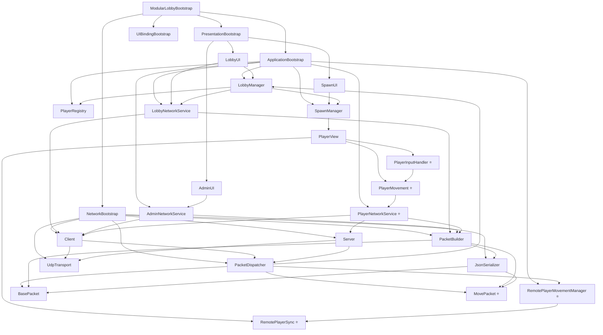

# Red Hunt - Documentación del Proyecto

> Juego multijugador en Unity con arquitectura de red robusta, sincronización en tiempo real y lobby seguro.


---

## Índice

1. [Descripción general](#descripción-general)
2. [Arquitectura del sistema](#arquitectura-del-sistema)
3. [Protocolos de red](#protocolos-de-red)
4. [Flujos de mensajes y envío](#flujos-de-mensajes-y-envío)
5. [Estructura de los mensajes](#estructura-de-los-mensajes)
6. [Lógica de fragmentación](#lógica-de-fragmentación)
7. [Ejemplos de implementación](#ejemplos-de-implementación)
8. [Tabla de scripts](#tabla-de-scripts)
9. [Estructura del proyecto](#estructura-del-proyecto)
10. [Interfaz del usuario](#interfaz-del-usuario)
11. [Ejecución y uso](#ejecución-y-uso)
12. [Características principales](#características-principales)

---

## Descripción general

**Red Hunt** implementa una arquitectura de red en 4 capas desacopladas para comunicación en tiempo real entre jugadores. Usa **UDP** como protocolo principal para garantizar baja latencia en movimiento, con un sistema de lobby sin condiciones de carrera y sincronización por snapshots cada 100ms.

El proyecto está estructurado en:
- **Application Layer:** Lógica de negocio (lobby, jugadores, spawning)
- **Domains Layer:** Modelos y entidades
- **Network Layer:** Protocolos, transporte, serialización
- **Presentation Layer:** UI, input, rendering

---

## Arquitectura del sistema

### Vista general de capas

```
┌──────────────────────────────────────────────┐
│              PRESENTATION LAYER               │
│  PlayerMovement · PlayerInputHandler          │
│  RemotePlayerSync · LobbyUI · AdminUI         │
└────────────────────┬─────────────────────────┘
                     │ Events
┌────────────────────▼─────────────────────────┐
│              APPLICATION LAYER                │
│  LobbyManager · PlayerNetworkService          │
│  RemotePlayerMovementManager · SpawnManager   │
└────────────────────┬─────────────────────────┘
                     │ Network Messages
┌────────────────────▼─────────────────────────┐
│               NETWORK LAYER                   │
│  Client · Server · PacketDispatcher           │
│  PacketBuilder · JsonSerializer · Handlers    │
└────────────────────┬─────────────────────────┘
                     │ UDP Datagrams
┌────────────────────▼─────────────────────────┐
│              TRANSPORT LAYER                  │
│  UdpTransport (puerto 12345 configurable)     │
└────────┬───────────────┬────────────┬────────┘
         ▼               ▼            ▼
       HOST          CLIENT 1     CLIENT 2
```

### Ciclo de sincronización

```
t=0ms     PlayerInputHandler captura WASD + Mouse
          PlayerMovement aplica física al Rigidbody

t=100ms   [Cliente] PlayerNetworkService.SendMove()
            → MovePacket { position, rotation, velocity, isJumping }
            → Client envía UDP al servidor

          [Host] PlayerNetworkService.SendSnapshot()
            → SnapshotPacket con estado de TODOS los jugadores
            → BroadcastService envía a todos los clientes

t=116ms   RemotePlayerMovementManager.ProcessMove()
            → RemotePlayerSync actualiza targetPosition/targetRotation
            → Lerp suave cada frame
```

---

## Protocolos de red

### UDP (Protocolo principal)

**Características:**
- Bajo latencia (ideal para movimiento)
- Sin garantía de entrega (aceptable para movimiento)
- Sin orden garantizado (manejado por timestamps)
- Mejor para datos en tiempo real

**Implementación:**
```
UdpTransport.cs → Interfaz ITransport
├── Envío: UdpClient.SendAsync()
├── Recepción: ReceiveLoop() asincrónico
└── Manejo de errores: SocketException, ObjectDisposedException
```

**Ventajas en Red Hunt:**
- Movimiento sin retrasos de confirmación
- Permite snapshots frecuentes (100ms)
- Escalable a múltiples clientes
---

## Flujos de mensajes y envío

### Tipos de paquetes

| Tipo | Dirección | Descripción |
|---|---|---|
| ASSIGN_PLAYER | Servidor → Cliente | Asigna ID al cliente al conectarse |
| LOBBY_STATE | Servidor → Todos | Sincroniza lista de jugadores del lobby |
| PLAYER | Broadcast | Información de un jugador |
| MOVE | Cliente → Servidor | Posición/rotación/velocidad local |
| SNAPSHOT | Servidor → Todos | Estado de todos los jugadores |
| REMOVE_PLAYER | Broadcast | Jugador desconectado o expulsado |
| KICK | Servidor → Cliente | Expulsión por admin |
| DISCONNECT | Cliente → Servidor | Desconexión limpia |

### Flujo Cliente → Servidor

```
PlayerMovement.cs      (captura input local)
      ↓
PlayerNetworkService   (crea MovePacket)
      ↓
PacketBuilder          (serializa a JSON)
      ↓
Client.cs              (envía vía transport)
      ↓
UdpTransport           ──→ Servidor
```

### Flujo Servidor → Clientes (broadcast)

```
PlayerNetworkService   (recopila estados de todos)
      ↓
PacketBuilder          (crea SnapshotPacket)
      ↓
BroadcastService       (itera conexiones)
      ↓
Server.SendToClientAsync() × N
      ↓
UdpTransport.SendToAll()
```

### Flujo de recepción

```
UdpTransport.ReceiveLoop()
      ↓
OnMessageReceived event
      ↓
PacketDispatcher.Dispatch()
      ↓
Handler registrado por tipo
      ↓
Lógica de aplicación
```

---
---


### Diagrama de flujo de archivos y comunicación


## Estructura de los mensajes

### Formato de paquetes (JSON)

#### MovePacket

```json
{
  "type": "MOVE",
  "id": 2,
  "position": { "x": 10.5, "y": 1.2, "z": 5.3 },
  "rotation": { "x": 0, "y": 0.707, "z": 0, "w": 0.707 },
  "velocity": { "x": 5.0, "y": 0.0, "z": 0.0 },
  "isJumping": false,
  "timestamp": 1234567890
}
```

#### AssignPlayerPacket

```json
{
  "type": "ASSIGN_PLAYER",
  "id": 2
}
```

#### LobbyStatePacket

```json
{
  "type": "LOBBY_STATE",
  "Players": [
    { "Id": 1, "Name": "Host", "IsHost": true },
    { "Id": 2, "Name": "Player_2", "IsHost": false }
  ]
}
```

#### SnapshotPacket

```json
{
  "type": "SNAPSHOT",
  "players": [
    {
      "id": 1,
      "position": { "x": 0, "y": 1, "z": 0 },
      "rotation": { "x": 0, "y": 0, "z": 0, "w": 1 },
      "velocity": { "x": 0, "y": 0, "z": 0 },
      "isJumping": false
    },
    {
      "id": 2,
      "position": { "x": 5, "y": 1, "z": 5 },
      "rotation": { "x": 0, "y": 0.707, "z": 0, "w": 0.707 },
      "velocity": { "x": 3, "y": 0, "z": 0 },
      "isJumping": false
    }
  ]
}
```

### Estructura de paquete base

```csharp
[System.Serializable]
public class BasePacket
{
    public string type;  // Identificador del tipo
}
```

### Serialización

- **Tecnología:** JsonUtility de Unity
- **Clase:** JsonSerializer.cs
- **Método:** JsonUtility.ToJson() / JsonUtility.FromJson<T>()

---

## Lógica de fragmentación

### Propósito

Fragmentar mensajes grandes en paquetes más pequeños para asegurar entrega confiable por UDP y evitar pérdida de datos en redes con MTU limitado.

### MTU (Maximum Transmission Unit)

- Ethernet típico: 1500 bytes
- UDP overhead: ~28 bytes (IP + UDP headers)
- JSON overhead: ~50-100 bytes
- Payload seguro: ~1300-1400 bytes

### Estrategia de chunking

```csharp
[System.Serializable]
public class ChunkedPacket : BasePacket
{
    public int chunkIndex;      // Índice del fragmento
    public int totalChunks;     // Total de fragmentos
    public string messageId;    // ID del mensaje original
    public string payload;      // Contenido del fragmento
}
```

### Ejemplo de fragmentación

```
Mensaje original: 5000 bytes
Dividir en 4 fragmentos:

Chunk 1: { chunkIndex: 0, totalChunks: 4, payload: 1300 bytes }
Chunk 2: { chunkIndex: 1, totalChunks: 4, payload: 1300 bytes }
Chunk 3: { chunkIndex: 2, totalChunks: 4, payload: 1300 bytes }
Chunk 4: { chunkIndex: 3, totalChunks: 4, payload: 100 bytes }
```

### Algoritmo de recepción

```csharp
private Dictionary<string, List<ChunkedPacket>> chunks = 
    new Dictionary<string, List<ChunkedPacket>>();

public void ReceiveChunk(ChunkedPacket chunk)
{
    if (!chunks.ContainsKey(chunk.messageId))
    {
        chunks[chunk.messageId] = new List<ChunkedPacket>(chunk.totalChunks);
    }
    
    chunks[chunk.messageId][chunk.chunkIndex] = chunk;
    
    // Verificar si todos los fragmentos han llegado
    if (chunks[chunk.messageId].Count == chunk.totalChunks &&
        chunks[chunk.messageId].TrueForAll(c => c != null))
    {
        ReconstructMessage(chunk.messageId);
    }
}

private void ReconstructMessage(string messageId)
{
    var allChunks = chunks[messageId];
    string fullMessage = string.Concat(allChunks.Select(c => c.payload));
    
    // Procesar mensaje completo
    dispatcher.Dispatch(fullMessage, sender);
    
    chunks.Remove(messageId);
}
```

### Timeout de fragmentos

```csharp
private void CleanupExpiredChunks()
{
    var now = Time.time;
    var expired = chunks
        .Where(kv => now - kv.Value.FirstOrDefault()?.receivedTime > 30f)
        .Select(kv => kv.Key)
        .ToList();
    
    foreach (var messageId in expired)
    {
        chunks.Remove(messageId);
        Debug.LogWarning($"Timeout esperando fragmentos para {messageId}");
    }
}
```

**Estado actual:** Infraestructura lista, implementación de chunking automático en PacketBuilder.cs y recepción en PacketDispatcher.cs (próxima fase).

---

## Ejemplos de implementación

### Ejemplo 1: Enviar movimiento del jugador

```csharp
// En PlayerNetworkService.cs
private void SendMovePacket()
{
    var movePacket = new MovePacket
    {
        type = "MOVE",
        id = playerId,
        position = transform.position,
        rotation = transform.rotation,
        velocity = rigidbody.velocity,
        isJumping = animator.GetBool("IsJumping")
    };
    
    string json = serializer.Serialize(movePacket);
    client.SendToServerAsync(json);
}
```

### Ejemplo 2: Recibir y procesar MovePacket

```csharp
// Registrar handler en PacketDispatcher
dispatcher.Register("MOVE", HandleMovePacket);

// Handler
private void HandleMovePacket(string json, IPEndPoint sender)
{
    var movePacket = serializer.Deserialize<MovePacket>(json);
    remotePlayerMovementManager.ProcessMove(movePacket);
}
```

### Ejemplo 3: Interpolar movimiento remoto

```csharp
// En RemotePlayerSync.cs
public void UpdateMovement(MovePacket movePacket)
{
    // Lerp suave de posición
    targetPosition = movePacket.position;
    transform.position = Vector3.Lerp(
        transform.position, 
        targetPosition, 
        Time.deltaTime * interpolationSpeed
    );
    
    // Rotar hacia objetivo
    transform.rotation = Quaternion.Lerp(
        transform.rotation,
        movePacket.rotation,
        Time.deltaTime * rotationSpeed
    );
    
    // Aplicar velocidad horizontal
    rigidbody.velocity = new Vector3(
        movePacket.velocity.x,
        rigidbody.velocity.y,
        movePacket.velocity.z
    );
}
```

### Ejemplo 4: Broadcasting a todos los clientes

```csharp
// En BroadcastService.cs
public async Task BroadcastMessage(string message)
{
    var allClients = clientConnectionManager.GetAllConnections();
    await transport.SendToAll(message, allClients);
}
```

### Ejemplo 5: Registrar un handler de paquetes

```csharp
// En ConnectionHandler.cs
public void Init(PacketDispatcher dispatcher)
{
    dispatcher.Register("LOBBY_STATE", HandleLobbyState);
    dispatcher.Register("ASSIGN_PLAYER", HandleAssignPlayer);
    dispatcher.Register("REMOVE_PLAYER", HandleRemovePlayer);
}

private void HandleLobbyState(string json, IPEndPoint sender)
{
    var lobbyState = serializer.Deserialize<LobbyStatePacket>(json);
    lobbyManager.UpdateLobbyState(lobbyState);
}
```

---

## Tabla de scripts

### Application Layer

| Script | Función |
|--------|---------|
| LobbyManager.cs | Control del estado del lobby |
| LobbyNetworkService.cs | Comunicación de red del lobby |
| AdminNetworkService.cs | Gestión de admin (kick, etc) |
| PlayerNetworkService.cs | Sincronización de movimiento |
| RemotePlayerMovementManager.cs | Gestor de jugadores remotos |
| PlayerRegistry.cs | Registro de IDs de jugadores |
| SpawnManager.cs | Spawn/remoción de jugadores |
| JoinLobbyCommand.cs | Comando de unirse |
| LeaveLobbyCommand.cs | Comando de salida |

### Domains Layer

| Script | Función |
|--------|---------|
| Player.cs | Entidad del jugador |
| PlayerSession.cs | Sesión de un jugador |
| LobbyState.cs | Enumeración de estados |
| PlayerType.cs | Tipo de jugador |

### Network Layer

| Script | Función |
|--------|---------|
| UdpTransport.cs | Transporte UDP |
| Client.cs | Cliente de red |
| Server.cs | Servidor de red |
| PacketDispatcher.cs | Enrutador de paquetes |
| PacketBuilder.cs | Constructor de paquetes |
| JsonSerializer.cs | Serializador JSON |
| ClientPacketHandler.cs | Handler de cliente |
| AdminPacketHandler.cs | Handler de admin |
| ConnectionHandler.cs | Handler de conexión |
| BroadcastService.cs | Servicio de broadcast |

### Network Packets

| Script | Tipo | Función |
|--------|------|---------|
| BasePacket.cs | Base | Estructura base |
| MovePacket.cs | MOVE | Movimiento |
| AssignPlayerPacket.cs | ASSIGN_PLAYER | Asignar ID |
| LobbyStatePacket.cs | LOBBY_STATE | Estado del lobby |
| PlayerPacket.cs | PLAYER | Info del jugador |
| RemovePlayerPacket.cs | REMOVE_PLAYER | Remoción |
| KickPacket.cs | KICK | Expulsión |
| DisconnectPacket.cs | DISCONNECT | Desconexión |

### Presentation Layer

| Script | Función |
|--------|---------|
| PlayerMovement.cs | Movimiento del jugador |
| PlayerInputHandler.cs | Handler de input |
| RemotePlayerSync.cs | Sync de jugador remoto |
| PlayerView.cs | Representación visual |
| LobbyUI.cs | UI del lobby |
| AdminUI.cs | UI de admin |
| SpawnUI.cs | UI de spawn |
| ModularLobbyBootstrap.cs | Orquestador principal |

### Installers

| Script | Función |
|--------|---------|
| ApplicationInstaller.cs | Instala Application layer |
| NetworkInstaller.cs | Instala Network layer |
| PresentationInstaller.cs | Instala Presentation layer |
| AdminInstaller.cs | Instala servicios admin |

---

## Estructura del proyecto

```
Assets/red hunt/Scripts/
├── Application/
│   ├── Services/
│   │   ├── Admin/
│   │   │   └── AdminNetworkService.cs       # Lógica de kick y acciones de admin
│   │   ├── LobbyGame/
│   │   │   ├── LobbyManager.cs              # Estado y flujo del lobby
│   │   │   ├── LobbyNetworkService.cs       # Comunicación de red del lobby
│   │   │   ├── JoinLobbyCommand.cs          # Comando de entrada al lobby
│   │   │   ├── LeaveLobbyCommand.cs         # Comando de salida del lobby
│   │   │   └── ILobbyCommand.cs             # Interfaz base de comandos
│   │   └── Session/
│   │       ├── PlayerRegistry.cs            # Registro de IDs de jugadores
│   │       └── PlayerSession.cs             # Sesión individual de jugador
│   └── Systems/
│       ├── Player/
│       │   ├── PlayerNetworkService.cs      # Sync de movimiento (snapshots/MOVEs)
│       │   └── RemotePlayerMovementManager.cs # Gestor de jugadores remotos
│       └── Spawn/
│           └── SpawnManager.cs              # Spawn y remoción de jugadores
│
├── Domains/
│   ├── Entities/
│   │   └── Player.cs                        # Entidad jugador
│   └── Enums/
│       ├── LobbyState.cs                    # Estados del lobby
│       └── PlayerType.cs                    # Tipos de jugador
│
├── Network/
│   ├── Dispatching/
│   │   └── PacketDispatcher.cs              # Enrutador de paquetes por tipo
│   ├── Handlers/
│   │   ├── AdminPacketHandler.cs            # Handler de paquetes admin
│   │   └── ConnectionHandler.cs             # Handler de conexión/desconexión
│   ├── Interfaces/
│   │   ├── IClient.cs
│   │   ├── IServer.cs
│   │   ├── ITransport.cs
│   │   ├── ISerializer.cs
│   │   └── IGameConnection.cs
│   ├── Packets/
│   │   ├── BasePacket.cs                    # Estructura base { type }
│   │   ├── PacketBuilder.cs                 # Constructor de paquetes
│   │   ├── PlayerCreate/
│   │   │   ├── AssignPlayerPacket.cs
│   │   │   ├── LobbyStatePacket.cs
│   │   │   ├── PlayerPacket.cs
│   │   │   └── PlayerReadyPacket.cs
│   │   ├── PlayerDestroy/
│   │   │   ├── DisconnectPacket.cs
│   │   │   └── RemovePlayerPacket.cs
│   │   ├── Admin/
│   │   │   └── KickPacket.cs
│   │   └── Game/
│   │       └── MovePacket.cs                # position, rotation, velocity, isJumping
│   ├── Serialization/
│   │   └── JsonSerializer.cs                # JsonUtility wrapper
│   └── Transport/
│       ├── Client/
│       │   ├── Client.cs
│       │   ├── ClientPacketHandler.cs
│       │   └── ClientState.cs
│       ├── Server/
│       │   ├── Server.cs
│       │   ├── BroadcastService.cs
│       │   ├── ClientConnection.cs
│       │   └── ClientConnectionManager.cs
│       └── UdpTransport.cs                  # Implementación ITransport vía UDP
│
└── Presentation/
    ├── Bootstrap/
    │   ├── ModularLobbyBootstrap.cs          # Orquestador principal
    │   └── BoostrapModular/
    │       ├── ApplicationBootstrap.cs
    │       ├── NetworkBootstrap.cs
    │       ├── PresentationBootstrap.cs
    │       └── UIBindingBootstrap.cs
    ├── Player/
    │   ├── PlayerView.cs                     # Representación visual
    │   ├── PlayerMovement.cs                 # WASD + salto + cámara
    │   ├── PlayerInputHandler.cs             # Unity InputSystem (Move/Look/Jump)
    │   └── RemotePlayerSync.cs              # Interpolación Lerp de remotos
    └── UI/
        ├── Admin/
        │   ├── AdminUI.cs
        │   └── AdminPlayerEntry.cs
        └── Lobby/
            ├── LobbyUI.cs
            ├── LeaveButton.cs
            ├── ShutdownButton.cs
            └── SpawnUI.cs
```

---

## Interfaz del usuario

### Pantallas principales

#### 1. Pantalla de selección (Start)
```
┌──────────────────────────────┐
│      RED HUNT                │
│                              │
│  [HOST]  [CLIENT]           │
│                              │
│      ¿Qué rol eres?         │
└──────────────────────────────┘
```

#### 2. Pantalla de conexión (Connect)
```
HOST:
┌──────────────────────────────┐
│  Servidor escuchando...      │
│  IP: 192.168.1.100           │
│  Puerto: 12345               │
│  Esperando clientes...       │
│                              │
│  [INICIAR PARTIDA]           │
│  [DESCONECTAR]               │
└──────────────────────────────┘

CLIENT:
┌──────────────────────────────┐
│  Conectar a servidor:        │
│  IP: [_______________]       │
│  Puerto: [12345___]          │
│                              │
│  [CONECTAR]                  │
│  [CANCELAR]                  │
└──────────────────────────────┘
```

#### 3. Pantalla de lobby (Players)
```
┌──────────────────────────────────────┐
│  LOBBY - 2/4 Jugadores               │
│                                      │
│  [1] Host           [KICK]           │
│  [2] Player_2       [KICK]           │
│  [3] (vacío)                         │
│  [4] (vacío)                         │
│                                      │
│  [INICIAR PARTIDA]  [DESCONECTAR]   │
└──────────────────────────────────────┘
```

#### 4. Pantalla de admin
```
┌──────────────────────────────────────┐
│  ADMINISTRACIÓN DE JUGADORES          │
│                                      │
│  ID | Nombre      | Estado  | Acción│
│  ---|-------------|---------|-------|
│   1 | Host        | Listo   | -     │
│   2 | Player_A    | Listo   | KICK  │
│   3 | Player_B    | Listo   | KICK  │
│                                      │
│  [CERRAR SERVIDOR]                   │
└──────────────────────────────────────┘
```

### Estados y transiciones

```
START
  ├─ (Host) → HOSTING
  │           ├─ LOBBY (esperando clientes)
  │           ├─ GAME (jugando)
  │           └─ SHUTDOWN
  │
  └─ (Client) → CONNECTING
                ├─ CONNECTED
                ├─ LOBBY
                ├─ GAME
                └─ DISCONNECTED
```

### Componentes de UI

| Componente | Ubicación | Función |
|-----------|-----------|---------|
| LobbyUI.cs | Canvas/LobbyPanel | Pantalla principal del lobby |
| AdminUI.cs | Canvas/AdminPanel | Panel de administración |
| SpawnUI.cs | Canvas/SpawnPanel | Mostrar jugadores spawned |
| LeaveButton.cs | Canvas/LeaveButton | Abandonar lobby |
| ShutdownButton.cs | Canvas/ShutdownButton | Apagar servidor |
| AdminPlayerEntry.cs | Canvas/AdminPanel/PlayersList | Entrada de jugador |

---

## Ejecución y uso

### Requisitos

- Unity 2021.3 LTS o superior
- .NET Framework 4.7.1+
- Windows, macOS, Linux

### Compilación

```bash
# Navegar al directorio del proyecto
cd red-hunt

# Compilar con dotnet
dotnet build red-hunt.slnx

# Ejecutar desde Unity Editor o build compilado
```

### Modo Host

1. Abrir escena LobbyScene
2. Seleccionar Host → Iniciar
3. El servidor escucha en el puerto configurado (por defecto 12345)

### Modo Cliente

1. Abrir escena LobbyScene
2. Seleccionar Cliente
3. Ingresar IP del host (ej: 127.0.0.1)
4. Presionar Conectar
5. Esperar asignación de ID

### Flujo típico de sesión

```
1. Host inicia servidor
2. Clientes se conectan → Reciben ID (2, 3, 4...)
3. Clientes reciben LOBBY_STATE
4. Players aparecen en la escena (SpawnManager)
5. PlayerInputHandler captura input
6. PlayerMovement aplica física
7. PlayerNetworkService sincroniza:
   - Host: snapshots cada 100ms
   - Clientes: MOVEs cada 100ms
8. RemotePlayerSync interpola movimiento
9. Host presiona "Iniciar partida"
10. Transición a GameScene
```

### Controles

| Tecla | Acción |
|---|---|
| WASD | Movimiento en 8 direcciones |
| Mouse | Rotación de cámara |
| Espacio | Saltar |
| ESC | Menú / Desconectar |

---

## Características principales

| Característica | Detalle |
|---|---|
| Movimiento | 8 direcciones (WASD), salto con detección de terreno, cámara pitch/yaw |
| Sincronización | Host envía snapshots de todos los jugadores cada 100ms |
| Lobby seguro | Host siempre ID 1, IDs reutilizables, sin condiciones de carrera |
| Arquitectura | 4 capas: Application, Domains, Network, Presentation |
| Interpolación | Lerp suave de posición y rotación para jugadores remotos |
| Serialización | JSON con JsonUtility para compatibilidad total |
| Escalabilidad | Fácil de extender, bajo acoplamiento |
| Testeable | Inyección de dependencias, interfaces limpias |

---

## Roadmap

- [ ] Fragmentación automática de mensajes grandes (chunking sobre MTU)
- [ ] Predicción de movimiento (dead reckoning)
- [ ] TCP como fallback para mensajes críticos
- [ ] Sistema de autoridad distribuida
- [ ] Persistencia de estado en base de datos
- [ ] Balanceo de carga entre servidores

---

*Versión 1.0.0 — Última actualización: 19/04/2026*
